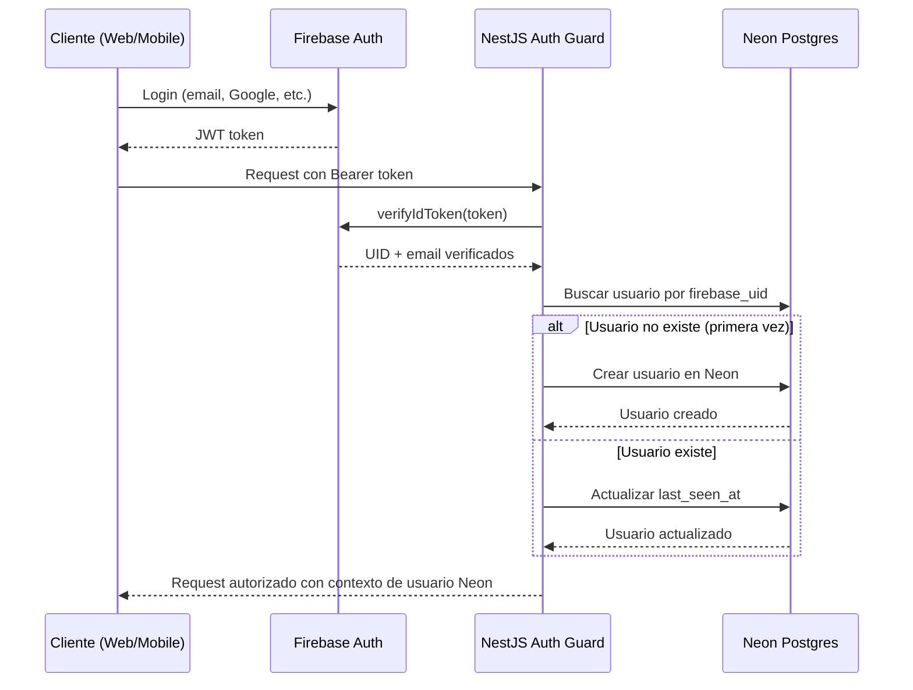
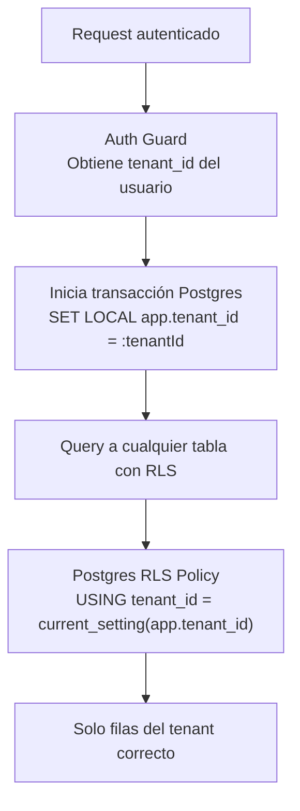
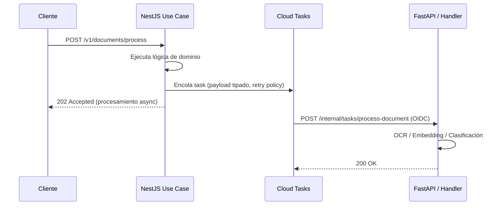
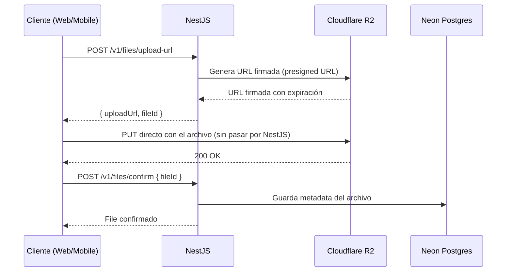
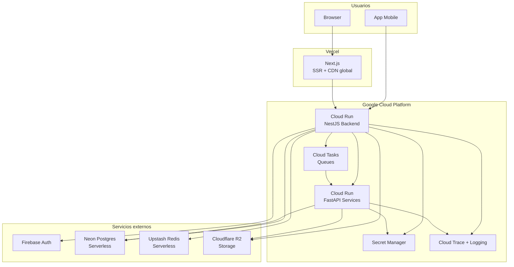

```mermaid
graph LR
    subgraph Firebase["Firebase Auth"]
        Login["Login / Registro"]
        Providers["OAuth Providers"]
        Token["Emisión de JWT"]
    end

    subgraph Backend["NestJS Backend"]
        Validate["Validación del token"]
        Authorize["Autorización de negocio"]
        TenantCheck["Verificación de tenant"]
        PermCheck["Verificación de permisos"]
    end

    subgraph Neon["Neon Postgres"]
        UserData["Datos del usuario"]
        Roles["Roles y plan"]
        Permissions["Permisos por recurso"]
    end

    Firebase -->|JWT| Backend
    Backend -->|Consulta| Neon
```

# ARCHITECTURE MASTER DOCUMENT
## Stack: Next.js + Flutter + NestJS + FastAPI

> **Documento para agentes de IA.**
> Todas las decisiones están tomadas. No hay opciones a elegir. Sigue este documento como fuente de verdad al scaffoldear un proyecto nuevo. No improvises estructura, no cambies naming sin justificación, no omitas capas.

---

## Dónde ir

Lee este documento completo primero. Luego navega al documento de tu plataforma:

| Estoy construyendo... | Lee este documento |
|---|---|
| La aplicación web (Next.js) | [ARCHITECTURE_WEB.md](ARCHITECTURE_WEB.md) |
| La aplicación mobile (Flutter) | [ARCHITECTURE_MOBILE.md](ARCHITECTURE_MOBILE.md) |
| El backend (NestJS + FastAPI) | [ARCHITECTURE_BACKEND.md](ARCHITECTURE_BACKEND.md) |
| Un concern transversal | Este documento (continúa leyendo) |

---

## ÍNDICE

1. [Stack completo y justificaciones](#1-stack-completo-y-justificaciones)
2. [Vista general del sistema](#2-vista-general-del-sistema)
3. [Contrato de auth](#3-contrato-de-auth)
4. [Multi-tenancy](#4-multi-tenancy)
5. [Flujos de datos del sistema](#5-flujos-de-datos-del-sistema)
6. [Infraestructura y despliegue](#6-infraestructura-y-despliegue)
7. [Observabilidad](#7-observabilidad)
8. [Contrato de API](#8-contrato-de-api)
8. [Gestión de secretos](#8-gestión-de-secretos)
9. [Reglas no negociables](#9-reglas-no-negociables)

---

## 1. Stack completo y justificaciones

| Capa | Tecnología | Justificación |
|---|---|---|
| **Web** | Next.js 14+ (App Router) + TypeScript + Tailwind CSS | Framework React con SSR, SSG y App Router nativos. Mejor opción para landing + dashboard en un solo proyecto. |
| **Mobile** | Flutter (Dart) — cross-platform compilado a nativo | Compila a ARM nativo. Un solo codebase para iOS y Android con rendimiento real, no WebView. |
| **Backend core** | NestJS + TypeScript en **Google Cloud Run** | Escala a cero en tráfico bajo, se expande en picos. Arquitectura hexagonal en TypeScript con tipado compartible con el frontend. |
| **Servicios AI** | FastAPI + Python en **Google Cloud Run** | Python es el ecosistema natural para AI/ML. Aislado del backend core para escalar y actualizar independientemente. |
| **Base de datos** | Neon Postgres | Postgres serverless con elasticidad de costo real. Se pausa cuando no hay tráfico. |
| **Auth** | Firebase Authentication | Resuelve identidad, login, providers OAuth y sesiones. El backend maneja la autorización de negocio por separado. |
| **Storage** | Cloudflare R2 | Sin egress fees. Archivos e imágenes con URLs firmadas. Postgres solo guarda metadata. |
| **Caché** | Upstash Redis | Redis serverless sin servidores que mantener. Compatible con el modelo de Cloud Run. |
| **Event bus** | Google Cloud Tasks | Simple, integrado con Cloud Run, suficiente para side effects async. Pub/Sub solo si se necesitan múltiples suscriptores. |
| **Secretos** | Google Secret Manager | Secretos montados en Cloud Run como variables de entorno desde Secret Manager. Nunca en código ni repositorio. |
| **Migraciones DB** | Prisma Migrate | Migraciones versionadas, reproducibles y parte del pipeline CI/CD. |
| **Observabilidad** | OpenTelemetry + GCP (Trace + Logging + Monitoring) | Estándar vendor-neutral instrumentado una vez, exportado a GCP. |

### ¿Por qué Vercel para web?

Next.js es construido por Vercel. El despliegue en Vercel ofrece optimizaciones que Cloud Run no da sin trabajo extra: edge caching automático, ISR (Incremental Static Regeneration), preview deployments por rama, y CDN global sin configuración.

**Decisión fijada: Vercel para web.**

---

## 2. Vista general del sistema


---

## 3. Contrato de auth

**Regla fundamental:** Firebase autentica. El backend autoriza. La base de datos decide el negocio.



### Flujo de sincronización (primera vez)



### Responsabilidad por capa

| Capa | Responsabilidad de auth |
|---|---|
| Web | Inicializar Firebase client SDK, adjuntar token en requests, manejar logout en 401. Ver `ARCHITECTURE_WEB.md`. |
| Mobile | Inicializar Firebase client SDK, interceptor Dio con token, retry en 401. Ver `ARCHITECTURE_MOBILE.md`. |
| Backend | `verifyIdToken`, lazy creation de usuario en Neon, autorización de negocio. Ver `ARCHITECTURE_BACKEND.md`. |

---

## 4. Multi-tenancy

**Estrategia fijada: Row Level Security (RLS) en Postgres.**

El `tenant_id` proviene del usuario autenticado en Neon — **nunca del request body ni de query params**.



**Reglas:**
- Cada tabla multi-tenant tiene columna `tenant_id UUID NOT NULL` con índice.
- RLS se activa en Postgres para cada tabla multi-tenant.
- Nunca hacer queries a tablas con RLS sin haber seteado `app.tenant_id` en la transacción.
- Ningún endpoint acepta `tenant_id` como input del cliente.
- Tablas globales (catálogos, configuración del sistema) no usan RLS.

La implementación completa vive en `ARCHITECTURE_BACKEND.md` sección 8.

---

## 5. Flujos de datos del sistema

### Side effect async (Cloud Tasks)



### Subida de archivo



---

## 6. Infraestructura y despliegue



### Entornos

| Entorno | Propósito | Características |
|---|---|---|
| `dev` | Desarrollo local | Datos falsos, secretos locales en `.env.local`, servicios locales o emulados |
| `staging` | QA e integración | Datos anonimizados, servicios reales pero instancias separadas, deploy automático en merge a `main` |
| `prod` | Producción | Credenciales propias, Secret Manager, alertas activas, deploy manual o con aprobación |

---

## 7. Observabilidad

### Formato de log obligatorio

Todos los logs del sistema son JSON estructurado con estos campos mínimos. El `traceId` viaja en el header `X-Trace-ID` entre todos los servicios — web, mobile y backend deben adjuntarlo en cada request.

| Campo | Requerido | Descripción |
|---|---|---|
| `timestamp` | Sí | ISO 8601 |
| `level` | Sí | `debug`, `info`, `warn`, `error` |
| `service` | Sí | Nombre del servicio (`backend-core`, `ai-services`) |
| `traceId` | Sí | UUID del request (viaja en `X-Trace-ID`) |
| `message` | Sí | Descripción del evento |
| `context` | No | Objeto con datos relevantes (userId, tenantId, etc.) |

### Convención del traceId

- Cada request genera un UUID v4 como `traceId`.
- El cliente lo envía en el header `X-Trace-ID` (o lo genera si no tiene uno).
- El backend lo lee, lo propaga a todos sus logs y lo devuelve en el header `X-Trace-ID` de la respuesta.
- FastAPI recibe el `traceId` via Cloud Tasks y lo propaga en sus logs.

### Reglas de logging

- Nunca loggear datos sensibles: tokens, passwords, números de tarjeta, PII sin enmascarar.
- Siempre incluir `traceId` en cada log statement.
- Los errores de dominio se loggean como `warn`. Los errores de infraestructura como `error`.

La implementación completa de OpenTelemetry y alertas vive en `ARCHITECTURE_BACKEND.md` sección 11.

---

## 8. Contrato de API

### Versionado

Todos los endpoints públicos viven bajo `/v1/`. El versionado es por URL.

**Breaking change** (requiere `/v2/`): eliminar o renombrar campos de respuesta, cambiar tipo de campo, cambiar semántica de parámetro existente.

**No es breaking change** (no requiere `/v2/`): añadir campos opcionales a la respuesta, añadir parámetros opcionales, añadir endpoints nuevos.

La implementación y el proceso completo de versionado viven en `ARCHITECTURE_BACKEND.md` sección 13.

### Paginación

Todos los endpoints de listado usan **paginación cursor-based**. No se usa offset/page number.

```
GET /v1/[recurso]?cursor=[id]&limit=20
→ { data: [...], nextCursor: "abc123" | null, hasMore: true | false }
```

La implementación completa del contrato y los tipos viven en `ARCHITECTURE_BACKEND.md` sección 14.

---

## 9. Gestión de secretos

**Reglas universales — aplican a todas las capas:**

- Nunca commitear `.env` ni `.env.local`. Solo `.env.example` con valores vacíos y comentarios explicativos.
- Nunca poner secretos en código ni en repositorio.
- Los secretos en producción se rotan cada 90 días.

**Por capa:**

| Capa | Mecanismo |
|---|---|
| Backend (Cloud Run) | Google Secret Manager. Montados como env vars con `--set-secrets`. Cada servicio tiene su propio Service Account con mínimo privilegio. |
| Web (Vercel) | Variables `NEXT_PUBLIC_` para config pública (no secretos reales). Variables privadas para llamadas server-side. Ver `ARCHITECTURE_WEB.md`. |
| Mobile (Flutter) | `--dart-define` en tiempo de compilación. Nunca secretos en el binario. Ver `ARCHITECTURE_MOBILE.md`. |

---

## 10. Reglas no negociables

Estas reglas no tienen excepciones por deadline, por "es solo temporal" ni por preferencia personal.

| # | Regla |
|---|---|
| 1 | Ninguna feature importante empieza sin spec revisada. |
| 2 | No hay lógica de negocio en controllers, screens ni widgets. |
| 3 | No hay colores, spacing ni medidas hardcodeadas en features. |
| 4 | Ninguna feature accede a HTTP directamente. Solo a través del ApiClient. |
| 5 | Todo input externo se valida en el borde del sistema antes de entrar al dominio. |
| 6 | Todo endpoint de escritura requiere autenticación. |
| 7 | El dominio no importa infraestructura. Nunca. |
| 8 | Los errores de infraestructura nunca se exponen directamente a la UI. |
| 9 | Los side effects importantes salen por Cloud Tasks, no directo desde el use case. |
| 10 | No hay secretos en código ni en repositorio. |
| 11 | No hay acceso cross-tenant. El tenant_id viene del usuario autenticado. |
| 12 | Toda operación sensible es auditable. |
| 13 | Ninguna migración de DB rompe la versión anterior del código (expand/contract). |
| 14 | Ningún log contiene datos sensibles sin enmascarar. |
| 15 | Ningún servicio expone endpoints sin validación de identidad. |

---

*Versión: 3.0 — Marzo 2026*
*Este documento es el contrato del sistema. Para implementación, lee el documento de tu plataforma: `ARCHITECTURE_WEB.md`, `ARCHITECTURE_MOBILE.md`, o `ARCHITECTURE_BACKEND.md`.*
