# ARCHITECTURE MASTER DOCUMENT
## Stack: Next.js + Flutter + NestJS + FastAPI

> **Documento para agentes de IA.**
> Todas las decisiones están tomadas. No hay opciones a elegir. Sigue este documento como fuente de verdad al scaffoldear un proyecto nuevo. No improvises estructura, no cambies naming sin justificación, no omitas capas.

---

## ÍNDICE

1. [Stack completo y justificaciones](#1-stack-completo-y-justificaciones)
2. [Vista general del sistema](#2-vista-general-del-sistema)
3. [Arquitectura web — Next.js](#3-arquitectura-web--nextjs)
4. [Arquitectura mobile — Flutter](#4-arquitectura-mobile--flutter)
5. [Backend core — NestJS](#5-backend-core--nestjs)
6. [Servicios especializados — FastAPI](#6-servicios-especializados--fastapi)
7. [Theme architecture](#7-theme-architecture)
8. [Auth y sincronización de usuarios](#8-auth-y-sincronización-de-usuarios)
9. [Multi-tenancy](#9-multi-tenancy)
10. [Flujos de datos](#10-flujos-de-datos)
11. [Infraestructura y despliegue](#11-infraestructura-y-despliegue)
12. [Observabilidad](#12-observabilidad)
13. [Gestión de secretos y entornos](#13-gestión-de-secretos-y-entornos)
14. [Reglas no negociables](#14-reglas-no-negociables)
15. [Instrucciones imperativas para agentes](#15-instrucciones-imperativas-para-agentes)
16. [Checklist de proyecto nuevo](#16-checklist-de-proyecto-nuevo)

---

## 1. Stack completo y justificaciones

| Capa | Tecnología | Justificación |
|---|---|---|
| **Web** | Next.js 14+ (App Router) + TypeScript + Tailwind CSS | Framework React con SSR, SSG y App Router nativos. Mejor opción para landing + dashboard en un solo proyecto. |
| **Mobile** | Flutter (Dart) — cross-platform compilado a nativo | Compila a ARM nativo. Un solo codebase para iOS y Android con rendimiento real, no WebView. |
| **Backend core** | NestJS + TypeScript en **Google Cloud Run** | Escala a cero en tráfico bajo, se expande en picos. Arquitectura hexagonal en TypeScript con tipado compartible con el frontend. |
| **Servicios AI** | FastAPI + Python en **Google Cloud Run** | Python es el ecosistema natural para AI/ML. Aislado del backend core para escalar y actualizar independientemente. |
| **Base de datos** | Neon Postgres | Postgres serverless con elasticidad de costo real. Se pausa cuando no hay tráfico. |
| **Auth** | Firebase Authentication | Resuelve identidad, login, providers OAuth y sesiones. El backend maneja la autorización de negocio por separado. |
| **Storage** | Cloudflare R2 | Sin egress fees. Archivos e imágenes con URLs firmadas. Postgres solo guarda metadata. |
| **Caché** | Upstash Redis | Redis serverless sin servidores que mantener. Compatible con el modelo de Cloud Run. |
| **Event bus** | Google Cloud Tasks | Simple, integrado con Cloud Run, suficiente para side effects async. Pub/Sub solo si se necesitan múltiples suscriptores. |
| **Secretos** | Google Secret Manager | Secretos montados en Cloud Run como variables de entorno desde Secret Manager. Nunca en código ni repositorio. |
| **Migraciones DB** | Prisma Migrate | Migraciones versionadas, reproducibles y parte del pipeline CI/CD. |
| **Observabilidad** | OpenTelemetry + GCP (Trace + Logging + Monitoring) | Estándar vendor-neutral instrumentado una vez, exportado a GCP. |

### ¿Por qué Vercel para web?

Next.js es construido por Vercel. El despliegue en Vercel ofrece optimizaciones que Cloud Run no da sin trabajo extra: edge caching automático, ISR (Incremental Static Regeneration), preview deployments por rama, y CDN global sin configuración.

**Cloud Run para web solo si:** el equipo quiere consolidar toda la infraestructura en un solo proveedor y acepta gestionar el contenedor y el CDN manualmente.

**Decisión fijada: Vercel para web.**

---

## 2. Vista general del sistema

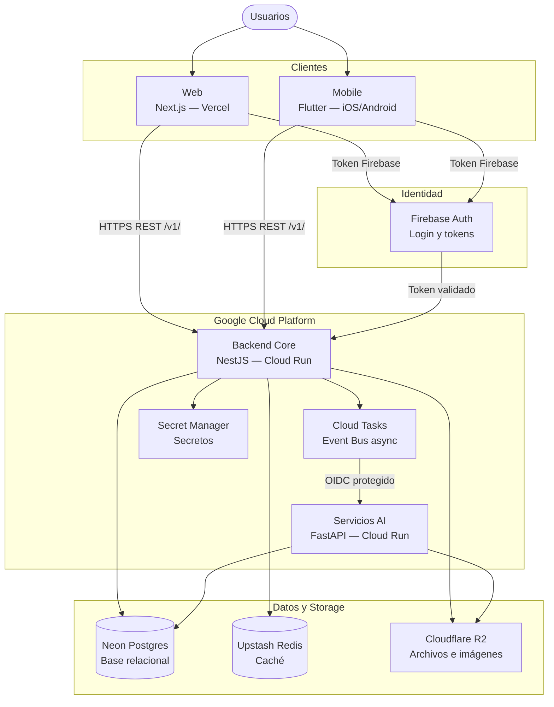

---

## 3. Arquitectura web — Next.js

### Responsabilidad

Next.js cubre: landing pública, paneles internos, dashboards, vistas autenticadas, reporting y formularios complejos de negocio.

### Flujo de datos web

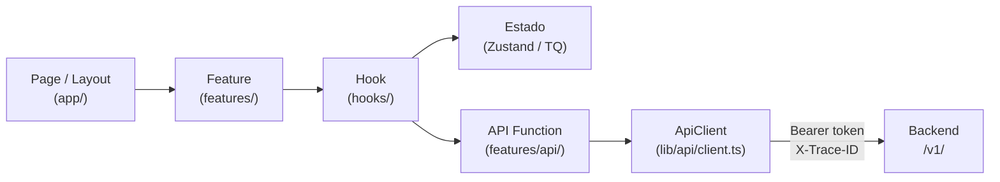

### Estructura de carpetas

```
src/
├── app/                    ← Rutas y layouts únicamente. Sin lógica de negocio.
│   ├── (public)/           ← Landing, marketing, páginas sin auth
│   ├── (auth)/             ← Login, registro, recuperación de contraseña
│   └── (dashboard)/        ← Paneles autenticados, una carpeta por sección
│
├── features/               ← Una carpeta por dominio del producto
│   ├── auth/
│   │   ├── components/     ← Componentes visuales propios de auth
│   │   ├── hooks/          ← useAuth, useSession
│   │   ├── store/          ← Estado global de auth (Zustand)
│   │   ├── api/            ← Funciones que llaman al ApiClient
│   │   └── types.ts        ← Tipos propios de la feature
│   ├── users/
│   ├── organizations/
│   ├── files/
│   └── billing/
│
├── components/
│   ├── ui/                 ← Piezas visuales puras: Button, Input, Modal, Table
│   └── shared/             ← Componentes de producto reutilizables: PageHeader, EmptyState
│
├── entities/               ← Tipos de dominio compartidos entre features
│   ├── user/
│   ├── organization/
│   └── file/
│
├── theme/                  ← Sistema visual. Ver sección 7.
│
├── lib/
│   ├── api/
│   │   └── client.ts       ← ApiClient único. Único punto de salida HTTP.
│   ├── auth/               ← Inicialización Firebase + manejo de sesión
│   └── utils/              ← Helpers genéricos
│
└── types/                  ← Tipos globales y declaraciones TypeScript
```

### Reglas de la capa web

- `app/` solo compone páginas usando features. No contiene lógica de negocio.
- `components/ui/` nunca conoce entidades del negocio ni llama APIs.
- `lib/api/client.ts` es el único archivo que puede hacer llamadas HTTP. No hay fetch ni axios en ningún otro lugar.
- Ningún componente de feature define colores, spacing o radios con valores literales.
- Estado global: Zustand. Estado de servidor (queries): TanStack Query. No se mezclan.

---

## 4. Arquitectura mobile — Flutter

> Flutter compila a código ARM nativo. Es cross-platform, no "no nativa". Esta distinción es importante al comunicar con clientes y stakeholders.

### Responsabilidad

Flutter cubre: aplicación mobile principal, autenticación mobile, pantallas operativas, consumo del backend compartido, flujos de carga y descarga de archivos.

### Flujo de datos mobile

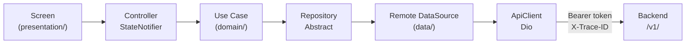

### Estructura de carpetas

```
lib/
├── core/                   ← Infraestructura base de la app
│   ├── network/            ← ApiClient (Dio), interceptores, endpoints
│   ├── auth/               ← AuthService, almacenamiento de token
│   ├── errors/             ← Tipos de error sellados (sealed class)
│   ├── config/             ← Variables de entorno, constantes
│   └── utils/              ← Extensions, formatters
│
├── ui/                     ← Librería de componentes reutilizables
│   ├── primitives/         ← AppButton, AppInput, AppCard, AppText
│   ├── components/         ← EmptyState, ErrorView, LoadingOverlay, PageHeader
│   └── layouts/            ← ScaffoldWithNav, AuthLayout
│
├── theme/                  ← Motor de tema. Ver sección 7.
│
├── app/                    ← Bootstrap de la aplicación
│   ├── router/             ← GoRouter: rutas y guards de navegación
│   ├── providers/          ← Riverpod ProviderScope, registro de providers
│   └── bootstrap/          ← Inicialización de servicios al arrancar
│
├── features/               ← Una carpeta por dominio del producto
│   ├── auth/
│   │   ├── data/
│   │   │   ├── datasources/    ← Llamadas HTTP concretas
│   │   │   ├── models/         ← Modelos JSON (freezed)
│   │   │   └── repositories/   ← Implementación del repositorio
│   │   ├── domain/
│   │   │   ├── entities/       ← Entidades puras sin dependencias externas
│   │   │   ├── repositories/   ← Contrato abstracto del repositorio
│   │   │   └── usecases/       ← Un caso de uso por acción de negocio
│   │   └── presentation/
│   │       ├── controllers/    ← StateNotifier de Riverpod
│   │       ├── screens/        ← Pantallas completas
│   │       └── widgets/        ← Widgets propios de esta feature
│   ├── home/
│   ├── profile/
│   └── files/
│
└── main.dart
```

### Reglas de la capa mobile

- Ninguna screen llama a HTTP directamente. El flujo es siempre: screen → controller → use case → repository → datasource → ApiClient.
- Ningún widget de feature usa colores, spacing o radios con valores literales.
- El tema siempre pasa por `ThemeData`, `ColorScheme` y extensiones propias. Nunca valores directos de color.
- Los controllers son `StateNotifier` de Riverpod. No hay `setState` para estado de negocio.
- Los repositorios son abstracciones (`abstract class`). Las implementaciones viven en `data/repositories/`.
- Cada use case tiene un único método público `execute()`.

---

## 5. Backend core — NestJS

### Responsabilidad

NestJS cubre: API principal, reglas de negocio, autorización, orquestación de workflows, integración con Neon, Firebase Auth, R2, Redis y Cloud Tasks.

### Patrón central — Arquitectura Hexagonal

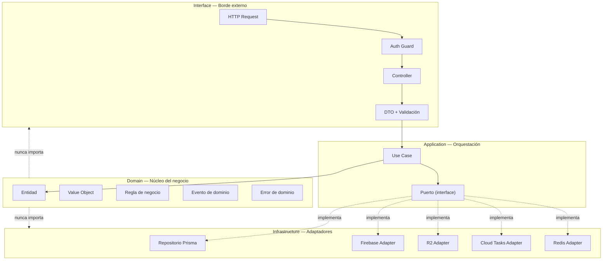

### Reglas de dependencia — estrictas

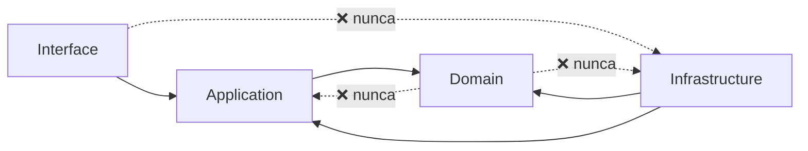

### Estructura de carpetas

```
src/
├── modules/
│   ├── auth/
│   │   ├── domain/
│   │   │   ├── entities/       ← Entidades puras
│   │   │   ├── ports/          ← Interfaces (contratos hacia infraestructura)
│   │   │   └── errors/         ← Errores tipados del dominio
│   │   ├── application/
│   │   │   └── use-cases/      ← Un archivo por caso de uso
│   │   ├── infrastructure/
│   │   │   └── adapters/       ← Implementaciones de los puertos
│   │   ├── interface/
│   │   │   ├── guards/         ← Firebase Auth guard
│   │   │   └── decorators/     ← CurrentUser, Roles
│   │   └── auth.module.ts
│   │
│   ├── users/                  ← Misma estructura de 4 capas
│   ├── organizations/          ← Misma estructura de 4 capas
│   ├── files/                  ← Misma estructura de 4 capas
│   └── billing/                ← Misma estructura de 4 capas
│
├── shared/
│   ├── domain/                 ← BaseEntity, BaseValueObject, DomainEvent
│   ├── application/            ← UseCase interface
│   ├── infrastructure/
│   │   ├── prisma/             ← PrismaService
│   │   ├── redis/              ← RedisService
│   │   ├── cloud-tasks/        ← CloudTasksService
│   │   ├── r2/                 ← R2Service
│   │   └── firebase/           ← FirebaseAdminService
│   ├── interface/
│   │   ├── interceptors/       ← TraceInterceptor, LoggingInterceptor
│   │   ├── filters/            ← DomainExceptionFilter
│   │   └── pipes/              ← ZodValidationPipe
│   └── config/                 ← Composition root, configuración global
│
└── main.ts
```

### Formato de error — estándar RFC 7807

Todos los errores del sistema devuelven este formato. Sin excepciones.

| Campo | Tipo | Descripción |
|---|---|---|
| `type` | string | Código de tipo de error |
| `title` | string | Mensaje legible para humanos |
| `status` | number | HTTP status code |
| `detail` | string | Detalle específico del error |
| `traceId` | string | Correlation ID del request |
| `timestamp` | string | ISO 8601 |
| `fieldErrors` | array | Solo en errores de validación: campo + mensaje |

### Reglas operativas del backend

- Los controllers ejecutan use cases y transforman DTOs. No contienen lógica de negocio.
- Los side effects (emails, notificaciones, webhooks) se despachan como Cloud Tasks desde el use case, no directamente.
- Todo endpoint de escritura tiene el Firebase Auth guard aplicado.
- Todo input externo se valida con Zod antes de llegar al controller.
- Cada request recibe un `traceId` en el interceptor de entrada que viaja en logs y en headers de respuesta.

---

## 6. Servicios especializados — FastAPI

### Responsabilidad

FastAPI procesa: OCR, embeddings, clasificación, procesamiento de documentos, tareas batch, agentes y pipelines AI.

### Regla de separación fundamental

NestJS orquesta. FastAPI procesa. La lógica de negocio principal no vive en FastAPI.

### Flujo de comunicación

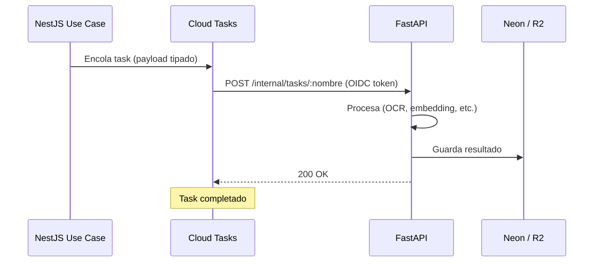

### Estructura de carpetas

```
app/
├── api/
│   └── v1/
│       ├── router.py           ← Registro de todos los endpoints
│       └── endpoints/          ← Un archivo por tipo de servicio (ocr, embeddings, etc.)
│
├── core/
│   ├── config.py               ← Variables de entorno
│   ├── security.py             ← Validación de OIDC token GCP
│   └── logging.py              ← Logging estructurado JSON
│
├── services/                   ← Lógica de procesamiento por dominio
├── models/                     ← Pydantic: requests y responses
├── workers/                    ← Procesamiento batch
└── main.py
```

### Seguridad

Los endpoints de FastAPI no son públicos. Solo reciben requests de Cloud Tasks (con OIDC token de GCP). No usan Firebase Auth.

---

## 7. Theme architecture

### Principio central

Cada proyecto tiene un tema propio. Lo que se define aquí no es la apariencia final — es la **estructura** que ese tema debe seguir. La apariencia (colores, tipografía, branding) es decisión de diseño por proyecto.

### Jerarquía de tokens

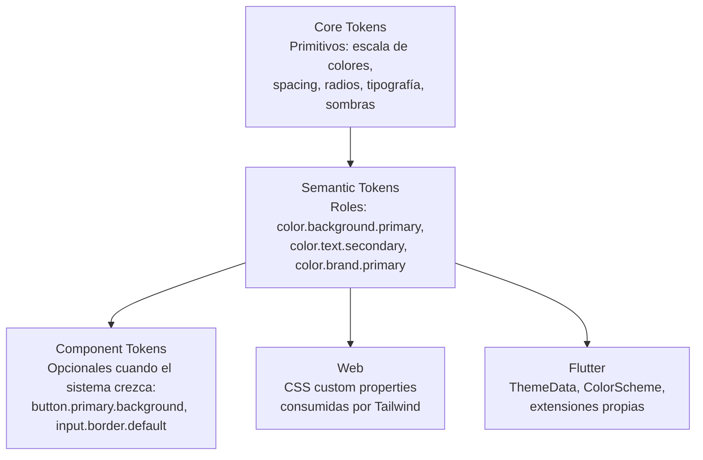

### Cuándo usar cada nivel

| Nivel | Cuándo usar |
|---|---|
| Core tokens | Siempre. Son la paleta y la escala. |
| Semantic tokens | Siempre. Son lo que los componentes consumen. |
| Component tokens | Solo cuando hay un design system establecido con múltiples productos o marca propia. No desde el día 1. |

### Estructura de carpetas del tema

```
theme/
├── tokens/
│   ├── core.ts             ← Primitivos: paleta completa, escala de spacing, escala de radios, tipografía
│   ├── semantic.light.ts   ← Roles semánticos para modo claro
│   └── semantic.dark.ts    ← Roles semánticos para modo oscuro
│
├── web/
│   ├── variables.css       ← Core y semantic tokens como CSS custom properties
│   └── tailwind.config.ts  ← Tailwind consume las variables CSS. No define colores propios.
│
└── flutter/
    ├── color_scheme.dart   ← ColorScheme generado desde semantic tokens
    ├── text_theme.dart     ← TextTheme generado desde semantic tokens
    ├── extensions.dart     ← AppColorsExtension, AppTextExtension
    └── app_theme.dart      ← ThemeData completo: light + dark
```

### Semantic tokens mínimos requeridos por proyecto

Estos roles deben estar definidos siempre, con independencia del color asignado:

| Categoría | Tokens mínimos |
|---|---|
| Background | `primary`, `secondary`, `tertiary` |
| Surface | `default`, `raised`, `overlay` |
| Text | `primary`, `secondary`, `disabled`, `inverse` |
| Border | `default`, `strong`, `focus` |
| Brand | `primary`, `primaryHover`, `primaryActive` |
| Status | `success`, `warning`, `error`, `info` |

### Reglas del tema

- Tailwind no define el tema. Solo consume los tokens via CSS custom properties en `tailwind.config.ts`.
- Ningún componente de feature usa clases de color directas de Tailwind (`text-blue-500`, `bg-slate-900`). Solo usa nombres semánticos mapeados.
- Flutter nunca usa `Colors.blue` ni valores literales de color en features. Solo usa las extensiones del tema (`Theme.of(context).extension<AppColors>()`).
- El tema se mantiene dentro del proyecto. Solo se extrae a librería separada cuando hay múltiples productos o escenarios white-label reales — no antes.

---

## 8. Auth y sincronización de usuarios

### División de responsabilidades

```mermaid
graph LR
    subgraph Firebase["Firebase Auth"]
        Login["Login / Registro"]
        Providers["OAuth Providers"]
        Token["Emisión de JWT"]
    end

    subgraph Backend["NestJS Backend"]
        Validate["Validación del token"]
        Authorize["Autorización de negocio"]
        TenantCheck["Verificación de tenant"]
        PermCheck["Verificación de permisos"]
    end

    subgraph Neon["Neon Postgres"]
        UserData["Datos del usuario"]
        Roles["Roles y plan"]
        Permissions["Permisos por recurso"]
    end

    Firebase -->|JWT| Backend
    Backend -->|Consulta| Neon
```

**Regla:** Firebase autentica. El backend autoriza. La base de datos decide el negocio.

### Flujo de sincronización de usuario (Firebase → Neon)

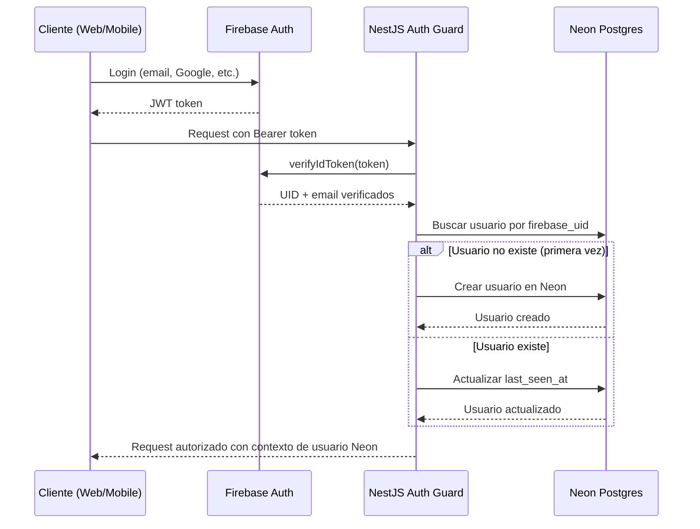

### Esquema mínimo de usuarios en Neon

| Campo | Tipo | Descripción |
|---|---|---|
| `id` | UUID | Identificador interno |
| `firebase_uid` | VARCHAR(128) UNIQUE | UID de Firebase |
| `email` | VARCHAR(255) UNIQUE | Email verificado |
| `name` | VARCHAR(255) | Nombre del usuario |
| `tenant_id` | UUID FK | Tenant al que pertenece |
| `role` | VARCHAR(50) | Rol: `owner`, `admin`, `member` |
| `plan` | VARCHAR(50) | Plan: `free`, `pro`, `enterprise` |
| `status` | VARCHAR(50) | Estado: `active`, `suspended`, `deleted` |
| `last_seen_at` | TIMESTAMPTZ | Último acceso |
| `created_at` | TIMESTAMPTZ | Fecha de creación |
| `updated_at` | TIMESTAMPTZ | Última modificación |

---

## 9. Multi-tenancy

### Estrategia fijada — Row Level Security (RLS)

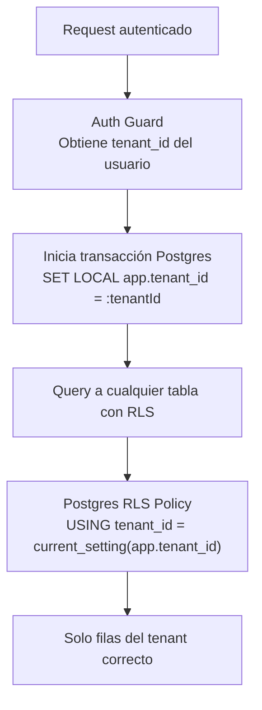

### Reglas de multi-tenancy

- Cada tabla multi-tenant tiene columna `tenant_id UUID NOT NULL` con índice.
- RLS se activa en Postgres para cada tabla multi-tenant.
- El `tenant_id` proviene del usuario autenticado en Neon — nunca del request body ni de query params.
- Nunca hacer queries a tablas con RLS sin haber seteado `app.tenant_id` en la transacción.
- Ningún endpoint acepta `tenant_id` como input del cliente para operaciones sobre sus propios datos.
- Tablas globales (catálogos, configuración del sistema) no usan RLS.

---

## 10. Flujos de datos

### Flujo de un side effect async (Cloud Tasks)

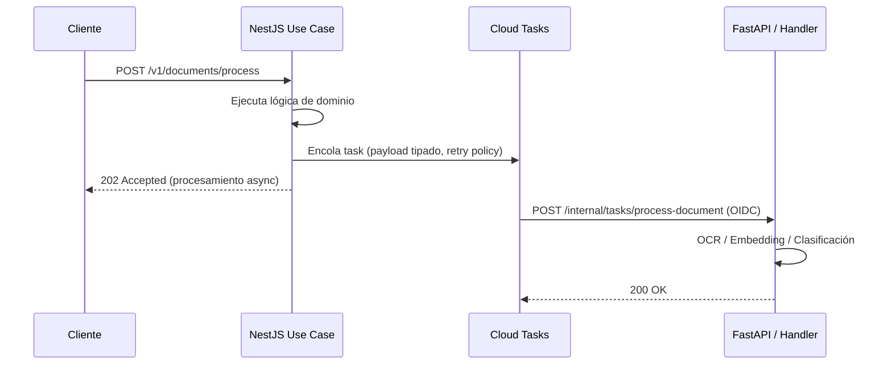

### Flujo de subida de archivo

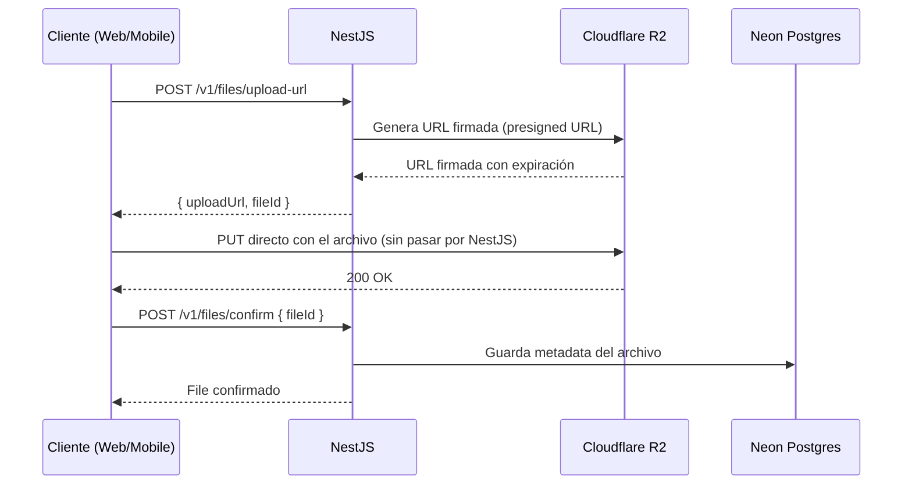

### Flujo de error

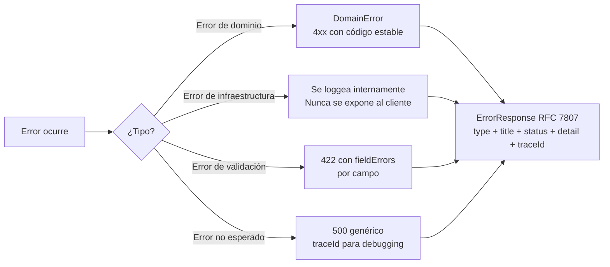

---

## 11. Infraestructura y despliegue

### Diagrama de infraestructura

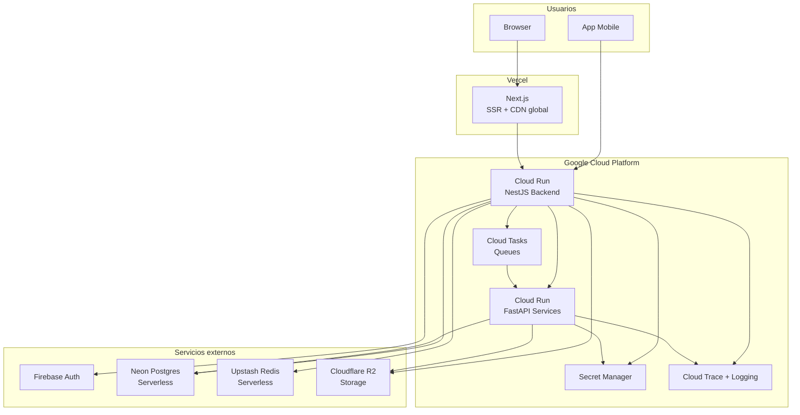

### Entornos

| Entorno | Propósito | Características |
|---|---|---|
| `dev` | Desarrollo local | Datos falsos, secretos locales en `.env.local`, servicios locales o emulados |
| `staging` | QA e integración | Datos anonimizados, servicios reales pero instancias separadas, deploy automático en merge a `main` |
| `prod` | Producción | Credenciales propias, Secret Manager, alertas activas, deploy manual o con aprobación |

### Variables de entorno por servicio

Estas variables deben estar definidas en cada entorno. Las marcadas como `[Secret]` se almacenan en Google Secret Manager, no como valores directos.

**Backend NestJS:**

| Variable | Secret | Descripción |
|---|---|---|
| `NODE_ENV` | No | `production` / `staging` / `development` |
| `PORT` | No | `8080` en Cloud Run |
| `DATABASE_URL` | Sí | Connection string de Neon Postgres |
| `FIREBASE_PROJECT_ID` | No | ID del proyecto Firebase |
| `FIREBASE_CLIENT_EMAIL` | Sí | Service account de Firebase Admin |
| `FIREBASE_PRIVATE_KEY` | Sí | Clave privada de Firebase Admin |
| `REDIS_URL` | Sí | URL de Upstash Redis |
| `R2_ACCOUNT_ID` | No | ID de cuenta Cloudflare |
| `R2_ACCESS_KEY_ID` | Sí | Key de acceso R2 |
| `R2_SECRET_ACCESS_KEY` | Sí | Secret de acceso R2 |
| `R2_BUCKET_NAME` | No | Nombre del bucket |
| `GOOGLE_CLOUD_PROJECT` | No | ID del proyecto GCP |
| `CLOUD_TASKS_QUEUE_LOCATION` | No | `us-central1` |
| `FASTAPI_INTERNAL_URL` | No | URL interna de FastAPI en Cloud Run |

---

## 12. Observabilidad

### Stack de observabilidad

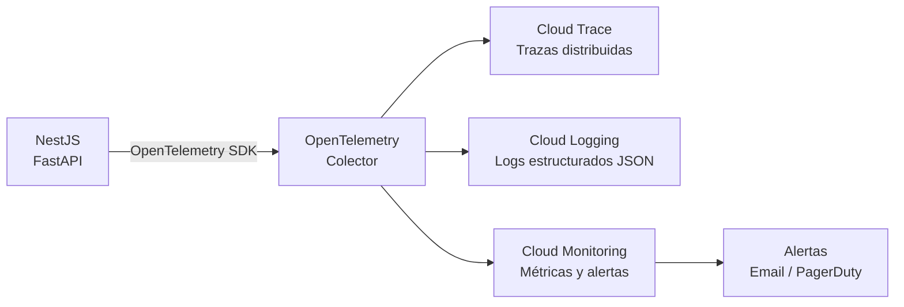

### Formato de log obligatorio

Todos los logs del sistema son JSON estructurado con estos campos mínimos:

| Campo | Requerido | Descripción |
|---|---|---|
| `timestamp` | Sí | ISO 8601 |
| `level` | Sí | `debug`, `info`, `warn`, `error` |
| `service` | Sí | Nombre del servicio (`backend-core`, `ai-services`) |
| `traceId` | Sí | UUID del request (viaja en `X-Trace-ID`) |
| `message` | Sí | Descripción del evento |
| `context` | No | Objeto con datos relevantes (userId, tenantId, etc.) |

### Alertas mínimas por servicio

| Alerta | Umbral | Acción |
|---|---|---|
| Error rate alto | > 1% en 5 minutos | Notificación inmediata |
| Latencia p99 alta | > 2 segundos | Notificación |
| Instancias Cloud Run altas | > umbral por servicio | Revisión de costo |
| Errores 5xx en aumento | Tendencia creciente | Revisión urgente |

### Reglas de logging

- Nunca loggear datos sensibles: tokens, passwords, números de tarjeta, PII sin enmascarar.
- Siempre incluir `traceId` en cada log statement.
- Los errores de dominio se loggean como `warn`. Los errores de infraestructura como `error`.
- El `traceId` viaja en el header `X-Trace-ID` entre todos los servicios.

---

## 13. Gestión de secretos y entornos

### Reglas de secretos

- Nunca commitear `.env` ni `.env.local`. Solo `.env.example` con valores vacíos y comentarios explicativos.
- En Cloud Run: los secretos se montan como variables de entorno referenciando Secret Manager con `--set-secrets`.
- Cada servicio tiene su propio Service Account con acceso solo a los secretos que necesita (principio de mínimo privilegio).
- Los secretos en producción se rotan cada 90 días.
- Variables no sensibles (URLs públicas, nombres de región, nombres de proyecto) pueden ir como variables de entorno directas en Cloud Run.

---

## 14. Reglas no negociables

Estas reglas no tienen excepciones por deadline, por "es solo temporal" ni por preferencia personal.

| # | Regla |
|---|---|
| 1 | Ninguna feature importante empieza sin spec revisada. |
| 2 | No hay lógica de negocio en controllers, screens ni widgets. |
| 3 | No hay colores, spacing ni medidas hardcodeadas en features. |
| 4 | Ninguna feature accede a HTTP directamente. Solo a través del ApiClient. |
| 5 | Todo input externo se valida en el borde del sistema antes de entrar al dominio. |
| 6 | Todo endpoint de escritura requiere autenticación. |
| 7 | El dominio no importa infraestructura. Nunca. |
| 8 | Los errores de infraestructura nunca se exponen directamente a la UI. |
| 9 | Los side effects importantes salen por Cloud Tasks, no directo desde el use case. |
| 10 | No hay secretos en código ni en repositorio. |
| 11 | No hay acceso cross-tenant. El tenant_id viene del usuario autenticado. |
| 12 | Toda operación sensible es auditable. |
| 13 | Ninguna migración de DB rompe la versión anterior del código (expand/contract). |
| 14 | Ningún log contiene datos sensibles sin enmascarar. |
| 15 | Ningún servicio expone endpoints sin validación de identidad. |

---

## 15. Instrucciones imperativas para agentes

> Instrucciones en modo imperativo directo. Sigue este orden al scaffoldear.

### Al crear un proyecto nuevo completo

1. Crea la estructura de carpetas exacta de cada capa definida en este documento.
2. Configura las dependencias base de cada capa (sección 1).
3. Crea el `ApiClient` base de web y mobile con los interceptores de auth y trace.
4. Configura Prisma con el schema mínimo: tablas `users` y `tenants` con RLS desde el inicio.
5. Activa RLS en todas las tablas multi-tenant desde el primer schema.
6. Configura `firebase-admin` en el shared module del backend.
7. Implementa el Auth Guard con lazy creation de usuario en Neon (flujo de la sección 8).
8. Configura OpenTelemetry en el backend antes de cualquier otra lógica.
9. Crea el `.env.example` con todas las variables de la sección 11 con valores vacíos.
10. Crea el `Dockerfile` para Cloud Run en backend y FastAPI.
11. Crea la estructura de tema base con los semantic tokens mínimos de la sección 7.
12. Verifica que ningún componente base tiene colores o valores hardcodeados.

### Al crear un nuevo módulo en el backend

1. Crea la carpeta bajo `src/modules/[nombre]/` con las cuatro subcarpetas: `domain/`, `application/`, `infrastructure/`, `interface/`.
2. Define la entidad en `domain/entities/`. Extiende `BaseEntity`.
3. Define los errores en `domain/errors/`. Extiende `DomainError`.
4. Define el puerto del repositorio en `domain/ports/` como interface TypeScript pura.
5. Crea los use cases en `application/use-cases/`. Uno por acción de negocio.
6. Implementa el repositorio en `infrastructure/repositories/` con Prisma. Implementa el puerto.
7. Crea el controller en `interface/controllers/`. Solo llama use cases.
8. Define los DTOs en `interface/dtos/` con Zod para validación.
9. Registra el módulo en NestJS y agrégalo a `app.module.ts`.

### Al crear una nueva feature en web

1. Crea `src/features/[nombre]/` con: `components/`, `hooks/`, `store/`, `api/`, `types.ts`.
2. Define los tipos en `types.ts`.
3. Crea las funciones en `api/` usando `apiClient`. Nunca fetch ni axios directo.
4. Crea el store en `store/` con Zustand si hay estado global. TanStack Query si es estado de servidor.
5. Crea los hooks en `hooks/` que orquestan store y llamadas API.
6. Crea los componentes en `components/` que consumen los hooks.
7. Agrega la página en `src/app/` que compone los componentes de la feature.

### Al crear una nueva feature en Flutter

1. Crea `lib/features/[nombre]/` con: `data/`, `domain/`, `presentation/`.
2. En `domain/`: crea la entidad, el abstract del repositorio y los use cases.
3. En `data/`: crea el modelo con freezed, el datasource remoto y la implementación del repositorio.
4. En `presentation/`: crea el controller (StateNotifier), las screens y los widgets.
5. Registra los providers en `app/providers/app_providers.dart`.
6. Agrega las rutas en `app/router/app_router.dart`.

### Al agregar un side effect async

1. Define el tipo del task en `shared/infrastructure/cloud-tasks/`.
2. Crea el handler en el módulo correspondiente como endpoint `POST /internal/tasks/[task-name]`.
3. Protege el endpoint con OIDC token de GCP, no con Firebase Auth.
4. Despacha el task desde el use case usando `CloudTasksService`. Nunca desde el controller.
5. Define retry policy y deadline en la configuración del task.

### Al agregar variables de entorno

1. Agrega la variable a `.env.example` con valor vacío y comentario explicativo.
2. Si es un secreto: agrégala a Google Secret Manager y referénciala en Cloud Run, no como valor directo.
3. Si no es un secreto (URL pública, nombre de región): va como variable de entorno directa.
4. Nunca pongas el valor real en ningún archivo commiteado.

---

## 16. Checklist de proyecto nuevo

Marca cada ítem antes de declarar el scaffold como completo.

### Estructura
- [ ] Estructura exacta de carpetas creada en cada capa (web, mobile, backend, FastAPI)
- [ ] Dependencias base instaladas en cada capa
- [ ] `.env.example` completo con todas las variables requeridas
- [ ] `.gitignore` configurado (node_modules, .env, build, .dart_tool, etc.)
- [ ] `Dockerfile` para backend NestJS y FastAPI

### Base de datos
- [ ] Schema Prisma con tablas base: `users`, `tenants`
- [ ] RLS activado en tablas multi-tenant
- [ ] Índices en `tenant_id` en todas las tablas con RLS
- [ ] Primera migración generada con `prisma migrate dev`

### Auth
- [ ] Firebase project configurado
- [ ] `firebase-admin` inicializado en el shared module
- [ ] Auth Guard implementado con lazy creation de usuario en Neon
- [ ] Flujo completo de sync (firebase_uid → Neon) probado

### Infraestructura
- [ ] Upstash Redis conectado y disponible como servicio
- [ ] Cloud Tasks configurado y disponible como servicio
- [ ] R2 conectado con generación de URLs firmadas funcionando
- [ ] Secret Manager configurado con todos los secretos del proyecto

### Observabilidad
- [ ] OpenTelemetry inicializado en el backend
- [ ] Trace interceptor implementado (genera traceId por request)
- [ ] Logging estructurado JSON configurado
- [ ] Alertas mínimas configuradas en Cloud Monitoring

### Theme
- [ ] Core tokens definidos para el proyecto
- [ ] Semantic tokens para light y dark definidos
- [ ] CSS custom properties generadas para web
- [ ] ThemeData base implementado en Flutter con extensiones
- [ ] Verificado que ningún componente base tiene colores hardcodeados

### Validación final
- [ ] Build de web pasa sin errores
- [ ] Build de Flutter pasa sin errores
- [ ] Build de backend pasa sin errores
- [ ] `GET /health` responde 200 correctamente
- [ ] Flujo completo de auth funciona end-to-end: login → token → request autenticado

---

*Versión: 2.1 — Marzo 2026*
*Fuente de verdad arquitectónica. Cualquier desviación debe estar justificada con un ADR (Architecture Decision Record) en el repositorio del proyecto.*