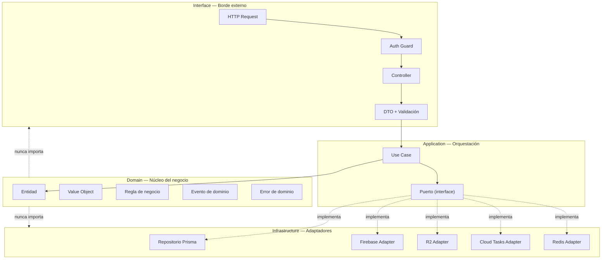
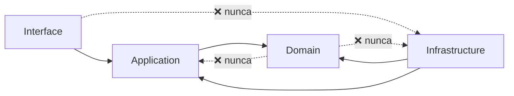
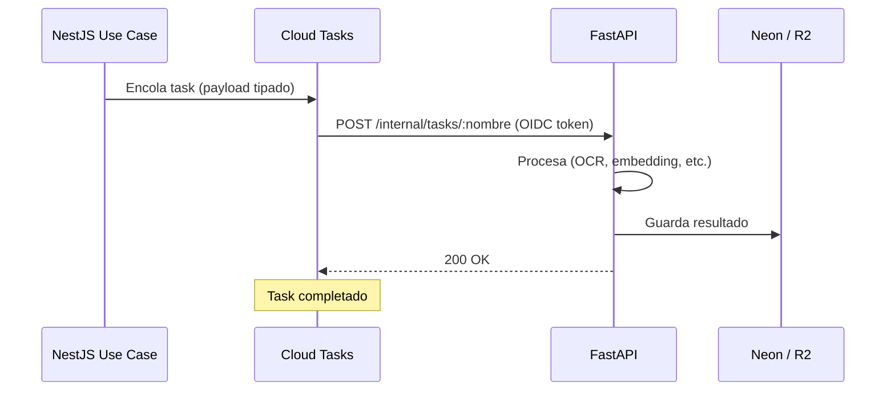
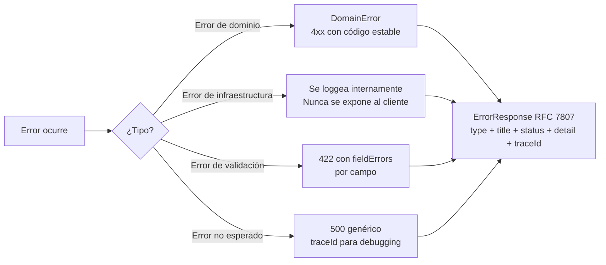
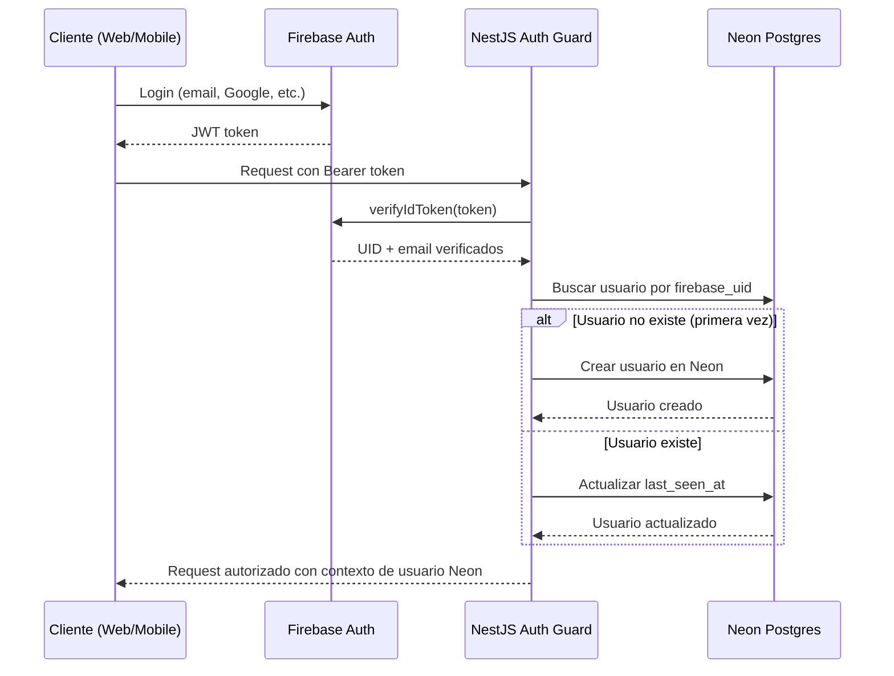
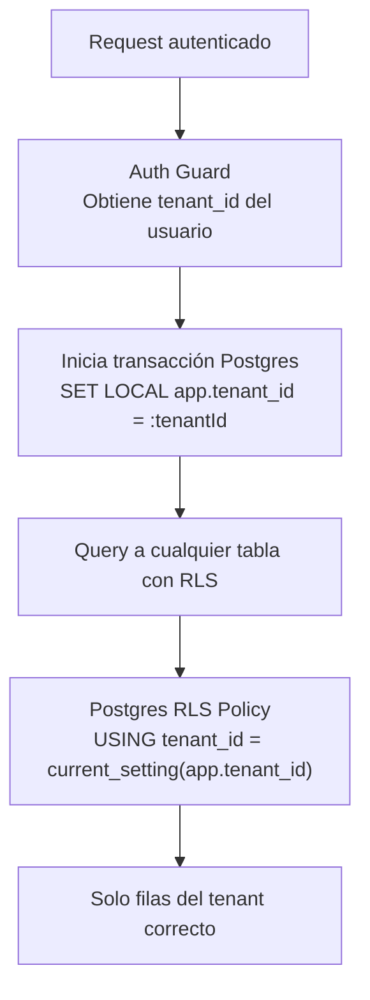
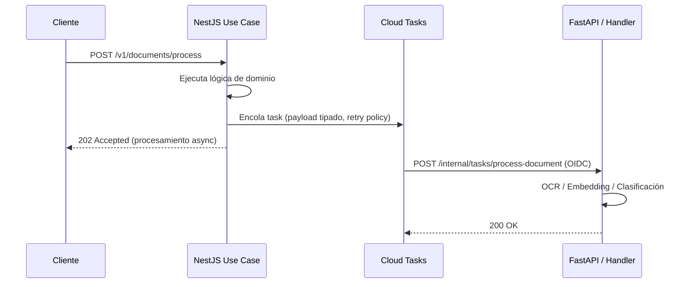
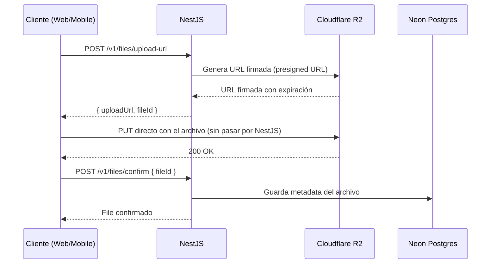
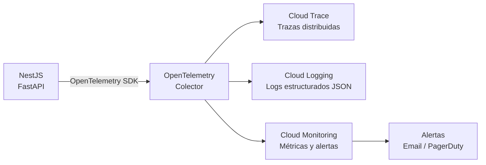

# ARCHITECTURE — Backend (NestJS + FastAPI)

> **Documento para agentes de IA.**
> Lee `ARCHITECTURE.md` primero para entender el sistema completo. Este documento cubre exclusivamente la capa backend: NestJS y FastAPI.
> Todas las decisiones están tomadas. Sigue este documento como fuente de verdad al scaffoldear o extender el backend. No improvises estructura ni cambies naming sin justificación.

---

## Stack de esta capa

| Componente | Tecnología |
|---|---|
| API principal | NestJS + TypeScript |
| AI/ML services | FastAPI + Python |
| Infraestructura | Google Cloud Run |
| Base de datos | Neon Postgres + Prisma |
| Caché | Upstash Redis |
| Storage | Cloudflare R2 |
| Event bus | Google Cloud Tasks |
| Auth identidad | Firebase Admin SDK |
| Secretos | Google Secret Manager |
| Observabilidad | OpenTelemetry → Cloud Trace + Logging + Monitoring |

---

## 1. Responsabilidad y scope

**NestJS** es la API principal del sistema. Cubre:
- Reglas de negocio y autorización
- Orquestación de workflows
- Integración con Neon, Firebase Auth, R2, Redis y Cloud Tasks
- Exposición de API REST `/v1/` para web y mobile

**FastAPI** procesa tareas especializadas de AI/ML. Cubre:
- OCR, embeddings, clasificación, procesamiento de documentos
- Tareas batch y pipelines AI
- Agentes y workflows de procesamiento

**Regla fundamental:** NestJS orquesta. FastAPI procesa. La lógica de negocio principal no vive en FastAPI.

**Lo que el backend NO hace:**
- Servir assets estáticos o el frontend web (eso es Vercel)
- Validar tokens Firebase en FastAPI (solo NestJS lo hace)
- Recibir requests directamente de clientes en FastAPI (solo vía Cloud Tasks)

---

## 2. Arquitectura Hexagonal — NestJS

### Diagrama de capas



### Reglas de dependencia — estrictas



---

## 3. Estructura de carpetas — NestJS

```
src/
├── modules/
│   ├── auth/
│   │   ├── domain/
│   │   │   ├── entities/       ← Entidades puras
│   │   │   ├── ports/          ← Interfaces (contratos hacia infraestructura)
│   │   │   └── errors/         ← Errores tipados del dominio
│   │   ├── application/
│   │   │   └── use-cases/      ← Un archivo por caso de uso
│   │   ├── infrastructure/
│   │   │   └── adapters/       ← Implementaciones de los puertos
│   │   ├── interface/
│   │   │   ├── guards/         ← Firebase Auth guard
│   │   │   └── decorators/     ← CurrentUser, Roles
│   │   └── auth.module.ts
│   │
│   ├── users/                  ← Misma estructura de 4 capas
│   ├── organizations/          ← Misma estructura de 4 capas
│   ├── files/                  ← Misma estructura de 4 capas
│   └── billing/                ← Misma estructura de 4 capas
│
├── shared/
│   ├── domain/                 ← BaseEntity, BaseValueObject, DomainEvent
│   ├── application/            ← UseCase interface
│   ├── infrastructure/
│   │   ├── prisma/             ← PrismaService
│   │   ├── redis/              ← RedisService
│   │   ├── cloud-tasks/        ← CloudTasksService
│   │   ├── r2/                 ← R2Service
│   │   └── firebase/           ← FirebaseAdminService
│   ├── interface/
│   │   ├── interceptors/       ← TraceInterceptor, LoggingInterceptor
│   │   ├── filters/            ← DomainExceptionFilter
│   │   └── pipes/              ← ZodValidationPipe
│   └── config/                 ← Composition root, configuración global
│
└── main.ts
```

---

## 4. Reglas operativas del backend

- Los controllers ejecutan use cases y transforman DTOs. No contienen lógica de negocio.
- Los side effects (emails, notificaciones, webhooks) se despachan como Cloud Tasks desde el use case, no directamente.
- Todo endpoint de escritura tiene el Firebase Auth guard aplicado.
- Todo input externo se valida con Zod antes de llegar al controller.
- Cada request recibe un `traceId` en el interceptor de entrada que viaja en logs y en headers de respuesta.
- Ningún controller ni use case importa directamente desde `infrastructure/`. Solo desde `domain/ports/`.

---

## 5. Servicio FastAPI

### Responsabilidad y restricciones

- Solo recibe requests de Cloud Tasks (con OIDC token de GCP). **No acepta requests directos de clientes.**
- No usa Firebase Auth. Solo valida OIDC tokens de GCP.
- No contiene lógica de negocio. Solo procesamiento especializado.
- Puede leer y escribir en Neon y R2 directamente.

### Flujo de comunicación



### Estructura de carpetas — FastAPI

```
app/
├── api/
│   └── v1/
│       ├── router.py           ← Registro de todos los endpoints
│       └── endpoints/          ← Un archivo por tipo de servicio (ocr, embeddings, etc.)
│
├── core/
│   ├── config.py               ← Variables de entorno
│   ├── security.py             ← Validación de OIDC token GCP
│   └── logging.py              ← Logging estructurado JSON
│
├── services/                   ← Lógica de procesamiento por dominio
├── models/                     ← Pydantic: requests y responses
├── workers/                    ← Procesamiento batch
└── main.py
```

---

## 6. Formato de error — RFC 7807

Todos los errores del sistema devuelven este formato. Sin excepciones.

| Campo | Tipo | Descripción |
|---|---|---|
| `type` | string | Código de tipo de error |
| `title` | string | Mensaje legible para humanos |
| `status` | number | HTTP status code |
| `detail` | string | Detalle específico del error |
| `traceId` | string | Correlation ID del request |
| `timestamp` | string | ISO 8601 |
| `fieldErrors` | array | Solo en errores de validación: campo + mensaje |

### Flujo de error



---

## 7. Auth — implementación completa

### División de responsabilidades

```mermaid
graph LR
    subgraph Firebase["Firebase Auth"]
        Login["Login / Registro"]
        Providers["OAuth Providers"]
        Token["Emisión de JWT"]
    end

    subgraph Backend["NestJS Backend"]
        Validate["Validación del token"]
        Authorize["Autorización de negocio"]
        TenantCheck["Verificación de tenant"]
        PermCheck["Verificación de permisos"]
    end

    subgraph Neon["Neon Postgres"]
        UserData["Datos del usuario"]
        Roles["Roles y plan"]
        Permissions["Permisos por recurso"]
    end

    Firebase -->|JWT| Backend
    Backend -->|Consulta| Neon
```



**Regla:** Firebase autentica. El backend autoriza. La base de datos decide el negocio.

### Flujo de sincronización (Firebase → Neon)



### Esquema mínimo de usuarios en Neon

| Campo | Tipo | Descripción |
|---|---|---|
| `id` | UUID | Identificador interno |
| `firebase_uid` | VARCHAR(128) UNIQUE | UID de Firebase |
| `email` | VARCHAR(255) UNIQUE | Email verificado |
| `name` | VARCHAR(255) | Nombre del usuario |
| `tenant_id` | UUID FK | Tenant al que pertenece |
| `role` | VARCHAR(50) | Rol: `owner`, `admin`, `member` |
| `plan` | VARCHAR(50) | Plan: `free`, `pro`, `enterprise` |
| `status` | VARCHAR(50) | Estado: `active`, `suspended`, `deleted` |
| `last_seen_at` | TIMESTAMPTZ | Último acceso |
| `created_at` | TIMESTAMPTZ | Fecha de creación |
| `updated_at` | TIMESTAMPTZ | Última modificación |

---

## 8. Multi-tenancy — Row Level Security

### Estrategia fijada: RLS en Postgres



### Reglas de multi-tenancy

- Cada tabla multi-tenant tiene columna `tenant_id UUID NOT NULL` con índice.
- RLS se activa en Postgres para cada tabla multi-tenant.
- El `tenant_id` proviene del usuario autenticado en Neon — **nunca del request body ni de query params**.
- Nunca hacer queries a tablas con RLS sin haber seteado `app.tenant_id` en la transacción.
- Ningún endpoint acepta `tenant_id` como input del cliente para operaciones sobre sus propios datos.
- Tablas globales (catálogos, configuración del sistema) no usan RLS.

---

## 9. Flujos de datos async

### Side effect con Cloud Tasks



### Subida de archivo (presigned URL)



---

## 10. Base de datos — Prisma

### Reglas de migración

- Usar siempre `prisma migrate dev` en desarrollo y `prisma migrate deploy` en CI/CD.
- Toda migración debe seguir el patrón **expand/contract**: nunca eliminar una columna o tabla en el mismo deploy que la reemplaza. Primero añadir la nueva estructura (expand), luego migrar datos, luego eliminar la antigua (contract) en un deploy posterior.
- RLS se activa desde el primer schema. No es algo que se agrega después.

### Schema mínimo de arranque

```prisma
model Tenant {
  id         String   @id @default(uuid())
  name       String
  slug       String   @unique
  plan       String   @default("free")
  status     String   @default("active")
  createdAt  DateTime @default(now())
  updatedAt  DateTime @updatedAt
  users      User[]
}

model User {
  id          String   @id @default(uuid())
  firebaseUid String   @unique @map("firebase_uid")
  email       String   @unique
  name        String
  tenantId    String   @map("tenant_id")
  role        String   @default("member")
  plan        String   @default("free")
  status      String   @default("active")
  lastSeenAt  DateTime? @map("last_seen_at")
  createdAt   DateTime @default(now())
  updatedAt   DateTime @updatedAt
  tenant      Tenant   @relation(fields: [tenantId], references: [id])

  @@index([tenantId])
  @@map("users")
}
```

### Setup de RLS en Postgres

```sql
-- Activar RLS en tabla multi-tenant
ALTER TABLE [tabla] ENABLE ROW LEVEL SECURITY;

-- Policy para lectura y escritura del tenant correcto
CREATE POLICY tenant_isolation ON [tabla]
  USING (tenant_id = current_setting('app.tenant_id')::uuid);

-- El PrismaService debe setear el contexto en cada transacción
-- SET LOCAL app.tenant_id = '[tenantId]';
```

---

## 11. Observabilidad — implementación backend

### Stack



### Implementación en NestJS

- Inicializar OpenTelemetry **antes de cualquier otro import** en `main.ts`.
- El `TraceInterceptor` en `shared/interface/interceptors/` genera un UUID como `traceId` para cada request y lo adjunta al header `X-Trace-ID` de la respuesta.
- Todos los logs incluyen `traceId`. Ver formato de log en `ARCHITECTURE.md` sección 12.

### Alertas mínimas a configurar

| Alerta | Umbral | Acción |
|---|---|---|
| Error rate alto | > 1% en 5 minutos | Notificación inmediata |
| Latencia p99 alta | > 2 segundos | Notificación |
| Instancias Cloud Run altas | > umbral por servicio | Revisión de costo |
| Errores 5xx en aumento | Tendencia creciente | Revisión urgente |

---

## 12. Variables de entorno

### Backend NestJS

| Variable | Secret | Descripción |
|---|---|---|
| `NODE_ENV` | No | `production` / `staging` / `development` |
| `PORT` | No | `8080` en Cloud Run |
| `DATABASE_URL` | Sí | Connection string de Neon Postgres |
| `FIREBASE_PROJECT_ID` | No | ID del proyecto Firebase |
| `FIREBASE_CLIENT_EMAIL` | Sí | Service account de Firebase Admin |
| `FIREBASE_PRIVATE_KEY` | Sí | Clave privada de Firebase Admin |
| `REDIS_URL` | Sí | URL de Upstash Redis |
| `R2_ACCOUNT_ID` | No | ID de cuenta Cloudflare |
| `R2_ACCESS_KEY_ID` | Sí | Key de acceso R2 |
| `R2_SECRET_ACCESS_KEY` | Sí | Secret de acceso R2 |
| `R2_BUCKET_NAME` | No | Nombre del bucket |
| `GOOGLE_CLOUD_PROJECT` | No | ID del proyecto GCP |
| `CLOUD_TASKS_QUEUE_LOCATION` | No | `us-central1` |
| `FASTAPI_INTERNAL_URL` | No | URL interna de FastAPI en Cloud Run |

### FastAPI

| Variable | Secret | Descripción |
|---|---|---|
| `ENVIRONMENT` | No | `production` / `staging` / `development` |
| `PORT` | No | `8080` en Cloud Run |
| `DATABASE_URL` | Sí | Connection string de Neon Postgres |
| `R2_ACCOUNT_ID` | No | ID de cuenta Cloudflare |
| `R2_ACCESS_KEY_ID` | Sí | Key de acceso R2 |
| `R2_SECRET_ACCESS_KEY` | Sí | Secret de acceso R2 |
| `R2_BUCKET_NAME` | No | Nombre del bucket |
| `GOOGLE_CLOUD_PROJECT` | No | ID del proyecto GCP |
| `ALLOWED_SERVICE_ACCOUNT` | No | Service account de Cloud Tasks autorizado |

### Reglas de secretos

- En Cloud Run: los secretos se montan como variables de entorno referenciando Secret Manager con `--set-secrets`.
- Cada servicio tiene su propio Service Account con acceso solo a los secretos que necesita (principio de mínimo privilegio).
- Los secretos en producción se rotan cada 90 días.
- Variables no sensibles pueden ir como variables de entorno directas en Cloud Run.
- Nunca commitear `.env` ni `.env.local`. Solo `.env.example` con valores vacíos.

---

## 13. Instrucciones para agentes — crear nuevo módulo backend

1. Crea la carpeta bajo `src/modules/[nombre]/` con las cuatro subcarpetas: `domain/`, `application/`, `infrastructure/`, `interface/`.
2. Define la entidad en `domain/entities/`. Extiende `BaseEntity`.
3. Define los errores en `domain/errors/`. Extiende `DomainError`.
4. Define el puerto del repositorio en `domain/ports/` como interface TypeScript pura.
5. Crea los use cases en `application/use-cases/`. Uno por acción de negocio.
6. Implementa el repositorio en `infrastructure/repositories/` con Prisma. Implementa el puerto.
7. Crea el controller en `interface/controllers/`. Solo llama use cases.
8. Define los DTOs en `interface/dtos/` con Zod para validación.
9. Registra el módulo en NestJS y agrégalo a `app.module.ts`.

---

## 14. Instrucciones para agentes — agregar side effect async

1. Define el tipo del task en `shared/infrastructure/cloud-tasks/`.
2. Crea el handler en el módulo correspondiente como endpoint `POST /internal/tasks/[task-name]`.
3. Protege el endpoint con OIDC token de GCP, **no con Firebase Auth**.
4. Despacha el task desde el use case usando `CloudTasksService`. Nunca desde el controller.
5. Define retry policy y deadline en la configuración del task.

---

## 15. Instrucciones para agentes — proyecto nuevo (backend)

1. Crea la estructura de carpetas exacta definida en la sección 3.
2. Configura las dependencias base de NestJS y FastAPI.
3. Configura Prisma con el schema mínimo: tablas `users` y `tenants` con RLS desde el inicio.
4. Activa RLS en todas las tablas multi-tenant desde el primer schema.
5. Configura `firebase-admin` en el shared module del backend.
6. Implementa el Auth Guard con lazy creation de usuario en Neon (flujo de la sección 7).
7. Configura OpenTelemetry en el backend **antes de cualquier otra lógica**.
8. Crea el `.env.example` con todas las variables de la sección 12 con valores vacíos.
9. Crea el `Dockerfile` para Cloud Run en backend y FastAPI.

---

## 16. Checklist de proyecto nuevo — backend

### Estructura
- [ ] Estructura exacta de carpetas de NestJS creada
- [ ] Estructura de FastAPI creada
- [ ] Dependencias base instaladas (NestJS, Prisma, firebase-admin, OpenTelemetry)
- [ ] `.env.example` completo con todas las variables requeridas
- [ ] `Dockerfile` para NestJS y FastAPI

### Base de datos
- [ ] Schema Prisma con tablas base: `users`, `tenants`
- [ ] RLS activado en tablas multi-tenant
- [ ] Índices en `tenant_id` en todas las tablas con RLS
- [ ] Primera migración generada con `prisma migrate dev`

### Auth
- [ ] Firebase project configurado
- [ ] `firebase-admin` inicializado en el shared module
- [ ] Auth Guard implementado con lazy creation de usuario en Neon
- [ ] Flujo completo de sync (firebase_uid → Neon) probado

### Infraestructura
- [ ] Upstash Redis conectado y disponible como servicio
- [ ] Cloud Tasks configurado y disponible como servicio
- [ ] R2 conectado con generación de URLs firmadas funcionando
- [ ] Secret Manager configurado con todos los secretos del proyecto

### Observabilidad
- [ ] OpenTelemetry inicializado en el backend
- [ ] Trace interceptor implementado (genera traceId por request)
- [ ] Logging estructurado JSON configurado
- [ ] Alertas mínimas configuradas en Cloud Monitoring

### Validación final
- [ ] Build de NestJS pasa sin errores
- [ ] Build de FastAPI pasa sin errores
- [ ] `GET /health` responde 200 correctamente
- [ ] Flujo completo de auth funciona end-to-end: login → token → request autenticado
- [ ] Multi-tenancy verificado: datos de un tenant no son visibles desde otro

---

*Versión: 1.0 — Marzo 2026*
*Derivado de ARCHITECTURE.md v2.1. Lee ese documento primero para el contexto del sistema completo.*
