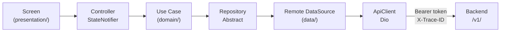

# ARCHITECTURE — Mobile (Flutter)

> **Documento para agentes de IA.**
> Lee `ARCHITECTURE.md` primero para entender el sistema completo. Este documento cubre exclusivamente la capa mobile: Flutter.
> Todas las decisiones están tomadas. Sigue este documento como fuente de verdad al scaffoldear o extender la aplicación mobile. No improvises estructura ni cambies naming sin justificación.

---

## Stack de esta capa

| Componente | Tecnología |
|---|---|
| Framework | Flutter (Dart) |
| Target | iOS + Android (compilado a ARM nativo) |
| HTTP client | Dio |
| Estado | Riverpod (StateNotifier / AsyncNotifier) |
| Navegación | GoRouter |
| Modelos | freezed + json_serializable |
| Auth cliente | Firebase Authentication (firebase_auth) |

---

## 1. Responsabilidad y scope

> Flutter compila a código ARM nativo. Es cross-platform, **no "no nativa"**. Esta distinción es importante al comunicar con clientes y stakeholders.

Flutter cubre: aplicación mobile principal, autenticación mobile, pantallas operativas, consumo del backend compartido, flujos de carga y descarga de archivos.

**Lo que la capa mobile NO hace:**
- Contener lógica de negocio (eso es el backend NestJS).
- Validar tokens Firebase server-side para autorización de negocio (eso es NestJS).
- Comunicarse directamente con Neon, Redis o cualquier base de datos.
- Gestionar archivos directamente (la subida va a R2 vía URLs firmadas que entrega NestJS).

---

## 2. Flujo de datos



---

## 3. Clean architecture — capas

### Regla de dependencia

```
presentation/ → domain/ ← data/
```

- `domain/` no tiene dependencias externas. Solo Dart puro.
- `data/` implementa los contratos de `domain/`.
- `presentation/` consume `domain/` via use cases.

### Responsabilidad de cada capa

| Capa | Vive en | Contiene |
|---|---|---|
| Domain | `features/[nombre]/domain/` | Entidades puras, repositorios abstractos, use cases |
| Data | `features/[nombre]/data/` | Modelos JSON (freezed), datasources remotos, implementaciones de repositorios |
| Presentation | `features/[nombre]/presentation/` | Controllers (StateNotifier), screens, widgets propios de la feature |

---

## 4. Estructura de carpetas

```
lib/
├── core/                   ← Infraestructura base de la app
│   ├── network/            ← ApiClient (Dio), interceptores, endpoints
│   ├── auth/               ← AuthService, almacenamiento de token
│   ├── errors/             ← Tipos de error sellados (sealed class)
│   ├── config/             ← Variables de entorno, constantes
│   └── utils/              ← Extensions, formatters
│
├── ui/                     ← Librería de componentes reutilizables
│   ├── primitives/         ← AppButton, AppInput, AppCard, AppText
│   ├── components/         ← EmptyState, ErrorView, LoadingOverlay, PageHeader
│   └── layouts/            ← ScaffoldWithNav, AuthLayout
│
├── theme/                  ← Motor de tema. Ver sección 9.
│
├── app/                    ← Bootstrap de la aplicación
│   ├── router/             ← GoRouter: rutas y guards de navegación
│   ├── providers/          ← Riverpod ProviderScope, registro de providers
│   └── bootstrap/          ← Inicialización de servicios al arrancar
│
├── features/               ← Una carpeta por dominio del producto
│   ├── auth/
│   │   ├── data/
│   │   │   ├── datasources/    ← Llamadas HTTP concretas
│   │   │   ├── models/         ← Modelos JSON (freezed)
│   │   │   └── repositories/   ← Implementación del repositorio
│   │   ├── domain/
│   │   │   ├── entities/       ← Entidades puras sin dependencias externas
│   │   │   ├── repositories/   ← Contrato abstracto del repositorio
│   │   │   └── usecases/       ← Un caso de uso por acción de negocio
│   │   └── presentation/
│   │       ├── controllers/    ← StateNotifier de Riverpod
│   │       ├── screens/        ← Pantallas completas
│   │       └── widgets/        ← Widgets propios de esta feature
│   ├── home/
│   ├── profile/
│   └── files/
│
└── main.dart
```

---

## 5. Reglas de la capa mobile

- Ninguna screen llama a HTTP directamente. El flujo siempre es: screen → controller → use case → repository → datasource → ApiClient.
- Ningún widget de feature usa colores, spacing o radios con valores literales.
- El tema siempre pasa por `ThemeData`, `ColorScheme` y extensiones propias. Nunca valores directos de color.
- Los controllers son `StateNotifier` de Riverpod. No hay `setState` para estado de negocio.
- Los repositorios son abstracciones (`abstract class`). Las implementaciones viven en `data/repositories/`.
- Cada use case tiene un único método público `execute()`.

---

## 6. ApiClient — contrato (Dio)

`core/network/` contiene el ApiClient basado en Dio. Es el único punto de salida HTTP de toda la aplicación mobile.

**Responsabilidades del ApiClient:**
- Adjuntar el Bearer token de Firebase en el header `Authorization`.
- Generar y adjuntar un UUID como `X-Trace-ID` en cada request.
- Manejar errores HTTP y transformarlos en errores tipados (`sealed class` en `core/errors/`).
- Interceptar 401 para refrescar token y reintentar.

**Estructura de interceptores Dio:**
```dart
// core/network/interceptors/auth_interceptor.dart
// Agrega Authorization: Bearer [token] a cada request

// core/network/interceptors/trace_interceptor.dart
// Agrega X-Trace-ID: [uuid] a cada request
```

**Cómo obtener el token:**
```dart
import 'package:firebase_auth/firebase_auth.dart';

final token = await FirebaseAuth.instance.currentUser?.getIdToken();
```

**Regla de retry en 401:**
1. Interceptar el 401.
2. Llamar `getIdToken(forceRefresh: true)`.
3. Reintentar el request original una vez.
4. Si vuelve a fallar, emitir un evento de logout.

---

## 7. Auth — perspectiva mobile

### Responsabilidad del cliente mobile

La capa mobile solo gestiona la identidad del usuario en el cliente:
- Inicializar el Firebase client SDK.
- Manejar el estado de sesión (login, logout, estado de carga inicial).
- Obtener y refrescar el token para adjuntarlo en cada request.

**La capa mobile NO valida tokens. NO toma decisiones de autorización de negocio.** Eso es responsabilidad del backend NestJS (ver `ARCHITECTURE_BACKEND.md` sección 7).

### Flujo en el cliente mobile

1. Usuario hace login → Firebase emite JWT.
2. El `AuthService` en `core/auth/` observa `FirebaseAuth.instance.authStateChanges()`.
3. El interceptor de Dio llama `getIdToken()` antes de cada request.
4. Si el backend responde 401, el interceptor intenta `getIdToken(forceRefresh: true)` y reintenta. Si vuelve a fallar, emite logout.

### Inicialización Firebase (mobile)

```dart
// app/bootstrap/app_bootstrap.dart
import 'package:firebase_core/firebase_core.dart';

await Firebase.initializeApp(
  options: DefaultFirebaseOptions.currentPlatform,
);
```

---

## 8. Estado — Riverpod

### Patrones establecidos

| Caso de uso | Pattern |
|---|---|
| Estado async (loading/data/error) | `AsyncNotifier` |
| Estado de negocio con acciones | `StateNotifier` |
| Estado derivado (computed) | `Provider` / `FutureProvider` |
| Estado de UI puro (ej: toggle) | `StateProvider` (solo para UI local) |

### Reglas de Riverpod

- Todo estado de negocio vive en Riverpod. No hay `setState` para estado de negocio.
- `setState` solo para estado de UI puramente local y efímero (ej: animaciones, focus).
- Registra todos los providers en `app/providers/app_providers.dart`.
- Los controllers solo consumen use cases del dominio. No llaman datasources directamente.

### Ejemplo de estructura de un provider

```dart
// features/auth/presentation/controllers/auth_controller.dart
class AuthController extends StateNotifier<AuthState> {
  final LoginUseCase _loginUseCase;

  AuthController(this._loginUseCase) : super(const AuthState.initial());

  Future<void> login(String email, String password) async {
    state = const AuthState.loading();
    final result = await _loginUseCase.execute(LoginParams(email, password));
    state = result.fold(
      (error) => AuthState.error(error),
      (user) => AuthState.authenticated(user),
    );
  }
}
```

---

## 9. Navegación — GoRouter

### Estructura

Las rutas viven en `app/router/app_router.dart`. Los guards de autenticación redirigen según el estado de auth.

### Reglas de navegación

- Todas las rutas están definidas en `app_router.dart`. No hay navegación ad-hoc con `Navigator.push` en features.
- El guard de auth observa el stream de `AuthService` para redirigir automáticamente.
- Los deep links se registran en `app_router.dart`.

### Ejemplo de guard de auth

```dart
redirect: (context, state) {
  final isAuthenticated = ref.read(authServiceProvider).isAuthenticated;
  final isGoingToAuth = state.matchedLocation.startsWith('/auth');

  if (!isAuthenticated && !isGoingToAuth) return '/auth/login';
  if (isAuthenticated && isGoingToAuth) return '/home';
  return null;
},
```

---

## 10. Theme architecture — Flutter

### Jerarquía de tokens

Los tokens siguen tres niveles: Core → Semantic → Component (ver diagrama en `ARCHITECTURE.md` sección 7).

Para Flutter, los semantic tokens se implementan como extensiones de `ThemeData`.

### Estructura de carpetas del tema (Flutter)

```
theme/
├── tokens/
│   ├── core.dart             ← Primitivos: paleta completa, escala de spacing, radios, tipografía
│   ├── semantic.light.dart   ← Roles semánticos para modo claro
│   └── semantic.dark.dart    ← Roles semánticos para modo oscuro
│
└── flutter/
    ├── color_scheme.dart   ← ColorScheme generado desde semantic tokens
    ├── text_theme.dart     ← TextTheme generado desde semantic tokens
    ├── extensions.dart     ← AppColorsExtension, AppTextExtension
    └── app_theme.dart      ← ThemeData completo: light + dark
```

### Cómo consumir el tema en un widget

```dart
// ✅ Correcto — usa extensión del tema
final colors = Theme.of(context).extension<AppColors>()!;
Container(color: colors.backgroundPrimary)

// ❌ Incorrecto — valor literal
Container(color: Colors.white)
Container(color: Color(0xFFFFFFFF))
```

### Semantic tokens mínimos requeridos

| Categoría | Tokens mínimos |
|---|---|
| Background | `backgroundPrimary`, `backgroundSecondary`, `backgroundTertiary` |
| Surface | `surfaceDefault`, `surfaceRaised`, `surfaceOverlay` |
| Text | `textPrimary`, `textSecondary`, `textDisabled`, `textInverse` |
| Border | `borderDefault`, `borderStrong`, `borderFocus` |
| Brand | `brandPrimary`, `brandPrimaryHover`, `brandPrimaryActive` |
| Status | `statusSuccess`, `statusWarning`, `statusError`, `statusInfo` |

### Reglas del tema Flutter

- Nunca usar `Colors.blue` ni valores literales de color en features.
- Nunca usar valores numéricos de color directos (`Color(0xFF...)`).
- Siempre usar `Theme.of(context).extension<AppColors>()` para colores.
- Siempre usar `Theme.of(context).textTheme` para tipografía.
- El tema soporta modo claro y oscuro via `ThemeData.light()` y `ThemeData.dark()`.

---

## 11. Variables de entorno — mobile (dart-define)

### Regla fundamental

**Nunca incluir secretos en la aplicación mobile.** Todo lo que va en el APK/IPA es visible para cualquiera que decomple el binario.

### Cómo pasar configuración al app

Usar `--dart-define` en tiempo de compilación:

```bash
flutter run \
  --dart-define=API_URL=https://api.example.com \
  --dart-define=FIREBASE_PROJECT_ID=my-project
```

### Variables de configuración de la app

| Variable | Tipo | Descripción |
|---|---|---|
| `API_URL` | Público | URL base del backend NestJS |
| `FIREBASE_PROJECT_ID` | Público | ID del proyecto Firebase |
| `APP_ENV` | Público | `production` / `staging` / `development` |

**Regla:** Las credenciales de Firebase (google-services.json / GoogleService-Info.plist) se tratan como configuración de plataforma, no como secretos — pero tampoco se commitean con valores de producción. Usa archivos distintos por entorno.

### Acceso en código

```dart
// core/config/app_config.dart
class AppConfig {
  static const apiUrl = String.fromEnvironment('API_URL');
  static const firebaseProjectId = String.fromEnvironment('FIREBASE_PROJECT_ID');
  static const appEnv = String.fromEnvironment('APP_ENV', defaultValue: 'development');
}
```

---

## 12. Instrucciones para agentes — crear nueva feature Flutter

1. Crea `lib/features/[nombre]/` con: `data/`, `domain/`, `presentation/`.
2. En `domain/`: crea la entidad, el abstract del repositorio y los use cases.
3. En `data/`: crea el modelo con freezed, el datasource remoto y la implementación del repositorio.
4. En `presentation/`: crea el controller (StateNotifier), las screens y los widgets.
5. Registra los providers en `app/providers/app_providers.dart`.
6. Agrega las rutas en `app/router/app_router.dart`.

---

## 13. Instrucciones para agentes — proyecto nuevo (mobile)

1. Crea la estructura de carpetas exacta definida en la sección 4.
2. Instala dependencias base: flutter, riverpod, dio, go_router, firebase_core, firebase_auth, freezed, json_serializable.
3. Crea el `ApiClient` base en `core/network/` con los interceptores de auth y trace.
4. Inicializa Firebase en `app/bootstrap/app_bootstrap.dart`.
5. Implementa el `AuthService` en `core/auth/` con `authStateChanges()`.
6. Configura GoRouter en `app/router/app_router.dart` con el guard de auth.
7. Crea la estructura de tema base en `theme/` con los semantic tokens mínimos de la sección 10.
8. Verifica que ningún componente base tiene colores o valores hardcodeados.

---

## 14. Checklist de proyecto nuevo — mobile

### Estructura
- [ ] Estructura exacta de carpetas creada
- [ ] Dependencias base instaladas (riverpod, dio, go_router, firebase_core, firebase_auth, freezed)
- [ ] `analysis_options.yaml` configurado con lints estrictos
- [ ] `.gitignore` configurado (build, .dart_tool, google-services.json de prod)

### Auth
- [ ] Firebase project configurado para iOS y Android
- [ ] Firebase inicializado en bootstrap
- [ ] `AuthService` implementado con `authStateChanges()`
- [ ] Interceptor de Dio implementado para adjuntar Bearer token
- [ ] Manejo de 401 (refresh + retry) implementado
- [ ] Guard de auth en GoRouter configurado
- [ ] Flujo completo de login → token → request autenticado probado

### ApiClient
- [ ] `core/network/` implementado con Dio + interceptores
- [ ] `X-Trace-ID` generado y adjuntado en cada request
- [ ] Errores HTTP transformados a `sealed class` tipados
- [ ] Ninguna feature llama HTTP directamente

### Theme
- [ ] Core tokens definidos para el proyecto
- [ ] Semantic tokens para light y dark definidos
- [ ] `AppColorsExtension` implementado
- [ ] `ThemeData` light y dark configurados en `app_theme.dart`
- [ ] Verificado que ningún widget base usa `Colors.X` o literales

### Validación final
- [ ] Build iOS pasa sin errores (`flutter build ios`)
- [ ] Build Android pasa sin errores (`flutter build appbundle`)
- [ ] Análisis estático sin errores (`flutter analyze`)
- [ ] Flujo de auth funciona end-to-end
- [ ] Modo oscuro funciona correctamente

---

*Versión: 1.0 — Marzo 2026*
*Derivado de ARCHITECTURE.md v2.1. Lee ese documento primero para el contexto del sistema completo.*
