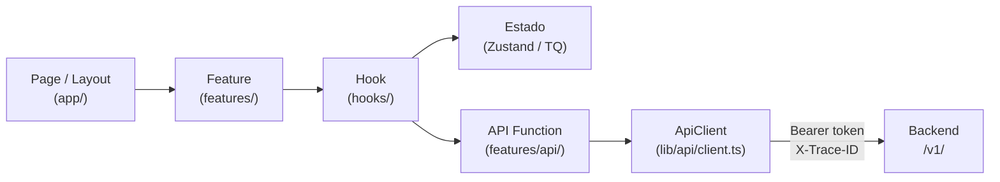

# ARCHITECTURE — Web (Next.js)

> **Documento para agentes de IA.**
> Lee `ARCHITECTURE.md` primero para entender el sistema completo. Este documento cubre exclusivamente la capa web: Next.js.
> Todas las decisiones están tomadas. Sigue este documento como fuente de verdad al scaffoldear o extender la aplicación web. No improvises estructura ni cambies naming sin justificación.

---

## Stack de esta capa

| Componente | Tecnología |
|---|---|
| Framework | Next.js 14+ (App Router) |
| Lenguaje | TypeScript |
| Estilos | Tailwind CSS |
| Estado global | Zustand |
| Estado de servidor | TanStack Query |
| Formularios | react-hook-form + Zod |
| Auth cliente | Firebase Authentication (client SDK) |
| Despliegue | Vercel |

---

## 1. Responsabilidad y scope

Next.js cubre: landing pública, paneles internos, dashboards, vistas autenticadas, reporting y formularios complejos de negocio.

**Lo que la capa web NO hace:**
- Contener lógica de negocio (eso es el backend NestJS).
- Validar tokens Firebase server-side para autorización de negocio (eso es NestJS).
- Gestionar archivos directamente (la subida va a R2 vía URLs firmadas que entrega NestJS).
- Comunicarse directamente con Neon, Redis o cualquier base de datos.

---

## 2. Flujo de datos



---

## 3. Estructura de carpetas

```
src/
├── app/                    ← Rutas y layouts únicamente. Sin lógica de negocio.
│   ├── (public)/           ← Landing, marketing, páginas sin auth
│   ├── (auth)/             ← Login, registro, recuperación de contraseña
│   └── (dashboard)/        ← Paneles autenticados, una carpeta por sección
│
├── features/               ← Una carpeta por dominio del producto
│   ├── auth/
│   │   ├── components/     ← Componentes visuales propios de auth
│   │   ├── hooks/          ← useAuth, useSession
│   │   ├── store/          ← Estado global de auth (Zustand)
│   │   ├── api/            ← Funciones que llaman al ApiClient
│   │   └── types.ts        ← Tipos propios de la feature
│   ├── users/
│   ├── organizations/
│   ├── files/
│   └── billing/
│
├── components/
│   ├── ui/                 ← Piezas visuales puras: Button, Input, Modal, Table
│   └── shared/             ← Componentes de producto reutilizables: PageHeader, EmptyState
│
├── entities/               ← Tipos de dominio compartidos entre features
│   ├── user/
│   ├── organization/
│   └── file/
│
├── theme/                  ← Sistema visual. Ver sección 8.
│
├── lib/
│   ├── api/
│   │   └── client.ts       ← ApiClient único. Único punto de salida HTTP.
│   ├── auth/               ← Inicialización Firebase + manejo de sesión
│   └── utils/              ← Helpers genéricos
│
└── types/                  ← Tipos globales y declaraciones TypeScript
```

---

## 4. Reglas de la capa web

- `app/` solo compone páginas usando features. No contiene lógica de negocio.
- `components/ui/` nunca conoce entidades del negocio ni llama APIs.
- `lib/api/client.ts` es el único archivo que puede hacer llamadas HTTP. No hay `fetch` ni `axios` en ningún otro lugar.
- Ningún componente de feature define colores, spacing o radios con valores literales.
- Estado global: Zustand. Estado de servidor (queries): TanStack Query. No se mezclan.
- Nunca usar clases de color directas de Tailwind (`text-blue-500`, `bg-slate-900`). Solo nombres semánticos mapeados desde el tema.

---

## 5. ApiClient — contrato

`lib/api/client.ts` es el único punto de salida HTTP de toda la aplicación web.

**Responsabilidades del ApiClient:**
- Adjuntar el Bearer token de Firebase en el header `Authorization`.
- Generar y adjuntar un UUID como `X-Trace-ID` en cada request.
- Manejar errores HTTP y transformarlos en errores tipados.

**Cómo obtener el token:**
```typescript
import { getAuth } from 'firebase/auth';

const token = await getAuth().currentUser?.getIdToken();
```

**Reglas:**
- Nunca importar ni usar `fetch` o `axios` fuera de `client.ts`.
- Nunca adjuntar el token manualmente en una feature. El ApiClient lo hace siempre.
- El `X-Trace-ID` viaja de vuelta en la respuesta y debe loggearse si hay error.

---

## 6. Auth — perspectiva web

### Responsabilidad del cliente web

La capa web solo gestiona la identidad del usuario en el cliente:
- Inicializar el Firebase client SDK.
- Manejar el estado de sesión (login, logout, estado de carga inicial).
- Obtener y refrescar el token para adjuntarlo en cada request.

**La capa web NO valida tokens. NO toma decisiones de autorización de negocio.** Eso es responsabilidad del backend NestJS (ver `ARCHITECTURE_BACKEND.md` sección 7).

### Flujo en el cliente

1. Usuario hace login → Firebase emite JWT.
2. El hook `useAuth` (en `features/auth/hooks/`) observa el estado de `onAuthStateChanged`.
3. El ApiClient llama `getIdToken()` antes de cada request para obtener el token vigente (Firebase refresca automáticamente si está expirado).
4. Si el backend responde 401, el ApiClient llama `getIdToken(forceRefresh: true)` y reintenta el request **una sola vez**.
5. Si el reintento también falla con 401: el ApiClient llama `signOut()` de Firebase y redirige a `/auth/login`. No se muestran más diálogos ni reintentos.
6. Si el usuario estaba en un formulario con datos no guardados: el estado del formulario se preserva en el store de Zustand de la feature. Al re-autenticarse, el usuario vuelve a la misma pantalla con los datos intactos. La feature es responsable de implementar esta preservación si aplica.

### Inicialización Firebase (web)

```typescript
// lib/auth/firebase.ts
import { initializeApp } from 'firebase/app';
import { getAuth } from 'firebase/auth';

const app = initializeApp({
  apiKey: process.env.NEXT_PUBLIC_FIREBASE_API_KEY,
  authDomain: process.env.NEXT_PUBLIC_FIREBASE_AUTH_DOMAIN,
  projectId: process.env.NEXT_PUBLIC_FIREBASE_PROJECT_ID,
});

export const auth = getAuth(app);
```

---

## 7. Manejo de errores — cliente web

### Principio

Los errores del backend llegan en formato RFC 7807 (ver `ARCHITECTURE_BACKEND.md` sección 6). El cliente los consume pero **nunca muestra mensajes técnicos de infraestructura al usuario**.

### Dónde vive cada responsabilidad

| Capa | Responsabilidad |
|---|---|
| `ApiClient` (`lib/api/client.ts`) | Parsea la respuesta de error HTTP. Transforma `ErrorResponse` en un error tipado (`ApiError`). Lanza el error para que lo capturen las capas superiores. |
| Hook / TanStack Query | Captura el error en el callback `onError`. Lo pasa al estado de la feature para que el componente lo muestre. |
| Componente de feature | Muestra mensajes de error al usuario. Solo muestra `error.title` o `error.detail` del RFC 7807, nunca el stack trace ni el `type` interno. |
| `ErrorBoundary` global | Captura errores de render no esperados. Muestra una pantalla de fallback genérica. **No** captura errores de red (esos los manejan los hooks). |

### Tipo `ApiError`

```typescript
// lib/api/errors.ts
export type ApiError = {
  type: string;       // código estable para lógica de cliente (ej: 'user/not-found')
  title: string;      // mensaje legible — este se muestra al usuario
  status: number;     // HTTP status code
  detail: string;     // detalle adicional — se muestra si es útil para el usuario
  traceId: string;    // se incluye en reportes de error y logs del cliente
};

export function isApiError(err: unknown): err is ApiError {
  return typeof err === 'object' && err !== null && 'type' in err && 'traceId' in err;
}
```

### Reglas de manejo de errores

- Nunca hacer `catch (e) { console.error(e) }` en silencio en features. Siempre propagar al estado.
- Los errores de validación (422 con `fieldErrors`) se mapean a los campos del formulario correspondiente. TanStack Query + react-hook-form facilita este patrón.
- Los errores 5xx muestran un mensaje genérico ("Algo salió mal, intenta de nuevo") con el `traceId` visible para que el usuario pueda reportarlo.
- El `ErrorBoundary` global vive en el root layout (`app/layout.tsx`). Cada sección de dashboard puede tener su propio `ErrorBoundary` para contener errores de render sin romper toda la app.

---

## 8. SSR vs Client Components — Next.js App Router

### Regla por defecto

**Todo componente es Server Component por defecto.** Solo se añade `'use client'` cuando hay una razón explícita. No se pone `'use client'` preventivamente ni "por si acaso".

### Cuándo usar `'use client'`

| Necesita `'use client'` | No necesita `'use client'` |
|---|---|
| Usa hooks de React (`useState`, `useEffect`, `useRef`, etc.) | Fetch de datos en servidor |
| Usa contexto de React (`useContext`) | Layouts y páginas estáticas |
| Usa eventos del DOM (`onClick`, `onChange`) | Componentes de solo presentación sin interactividad |
| Usa `useAuth`, `useStore` u otros hooks propios | Server Actions (formularios sin JS) |
| Integra librerías que requieren el browser (Firebase client SDK, analytics) | Componentes que solo muestran datos |

### Patrón: empujar `'use client'` hacia las hojas

El objetivo es que los Server Components envuelvan a los Client Components, no al revés. Los Server Components pueden importar Client Components, pero los Client Components **no pueden importar Server Components**.

```
app/(dashboard)/users/page.tsx        ← Server Component (fetch de datos)
  └── features/users/components/
        ├── UserList.tsx               ← Server Component (recibe datos como props)
        └── UserActions.tsx            ← 'use client' (tiene botones con onClick)
```

### Dónde vive Firebase client SDK

El Firebase client SDK **requiere browser**. Su inicialización y cualquier hook que lo use (`useAuth`, `getIdToken`) deben estar en Client Components o en `lib/auth/` llamado desde Client Components.

**Nunca importar Firebase client SDK en un Server Component.**

### Server Actions

Para formularios simples donde no se necesita estado de carga elaborado, usar Server Actions en lugar de fetch desde el cliente. Los Server Actions viven en archivos con `'use server'` o marcados con la directiva inline.

```typescript
// app/(dashboard)/profile/actions.ts
'use server'

export async function updateProfile(formData: FormData) {
  // Esta función corre en el servidor
  // Obtener el token de sesión via cookies (no desde Firebase client SDK)
}
```

### Reglas de Server vs Client

- Nunca poner `'use client'` en layouts principales sin razón. Un layout con `'use client'` convierte toda su subtree en Client Components.
- Los datos se fetchean en Server Components y se pasan como props a los Client Components que los muestran.
- El estado de UI local (modales, tabs, toggles) vive en Client Components. El estado de servidor vive en TanStack Query desde Client Components.
- `app/` contiene principalmente Server Components. `features/[nombre]/components/` puede mezclar según necesidad.

---

## 9. Formularios

### Stack fijado: react-hook-form + Zod

**react-hook-form** maneja el estado del formulario y la integración con componentes controlados. **Zod** define el schema de validación client-side. Los dos se conectan con `@hookform/resolvers/zod`.

### Responsabilidades de validación

| Capa | Qué valida | Cuándo |
|---|---|---|
| Zod (client) | Formato, campos requeridos, longitudes | Antes de enviar al backend |
| Backend (Zod en NestJS) | Reglas de negocio, unicidad, permisos | Siempre — el client-side es solo UX |

**El cliente nunca asume que su validación es suficiente.** Siempre se maneja el 422 del backend.

### Patrón estándar de formulario

```typescript
// features/[nombre]/components/ExampleForm.tsx
'use client'

import { useForm } from 'react-hook-form'
import { zodResolver } from '@hookform/resolvers/zod'
import { z } from 'zod'

const schema = z.object({
  email: z.string().email('Email inválido'),
  name: z.string().min(2, 'Mínimo 2 caracteres'),
})

type FormValues = z.infer<typeof schema>

export function ExampleForm() {
  const { register, handleSubmit, setError, formState: { errors, isSubmitting } } = useForm<FormValues>({
    resolver: zodResolver(schema),
  })

  const onSubmit = async (data: FormValues) => {
    try {
      await createSomething(data) // función en features/api/
    } catch (err) {
      if (isApiError(err) && err.status === 422) {
        // Mapear fieldErrors del backend a los campos del form
        err.fieldErrors?.forEach(({ field, message }) => {
          setError(field as keyof FormValues, { message })
        })
      }
    }
  }

  return (
    <form onSubmit={handleSubmit(onSubmit)}>
      <input {...register('email')} />
      {errors.email && <span>{errors.email.message}</span>}
      <button type="submit" disabled={isSubmitting}>Guardar</button>
    </form>
  )
}
```

### Reglas de formularios

- Todo formulario usa `react-hook-form`. No se manejan formularios con `useState` por campo.
- Todo formulario tiene un schema Zod. La validación client-side es siempre optimista (para UX), nunca la única línea de defensa.
- Los errores 422 del backend se mapean a los campos del formulario con `setError`. No se muestran como toast genérico si hay `fieldErrors`.
- El botón de submit se deshabilita con `isSubmitting` para evitar doble envío.
- Los schemas Zod de formularios viven en `features/[nombre]/types.ts` junto a los tipos de la feature.

---

## 11. Theme architecture — web

### Jerarquía de tokens

Los tokens siguen tres niveles: Core → Semantic → Component (ver diagrama en `ARCHITECTURE.md` sección 7).

Para la capa web, los semantic tokens se convierten en **CSS custom properties** y Tailwind las consume.

### Estructura de carpetas del tema (web)

```
theme/
├── tokens/
│   ├── core.ts             ← Primitivos: paleta completa, escala de spacing, radios, tipografía
│   ├── semantic.light.ts   ← Roles semánticos para modo claro
│   └── semantic.dark.ts    ← Roles semánticos para modo oscuro
│
└── web/
    ├── variables.css       ← Core y semantic tokens como CSS custom properties
    └── tailwind.config.ts  ← Tailwind consume las variables CSS. No define colores propios.
```

### Semantic tokens mínimos requeridos

| Categoría | Tokens mínimos |
|---|---|
| Background | `primary`, `secondary`, `tertiary` |
| Surface | `default`, `raised`, `overlay` |
| Text | `primary`, `secondary`, `disabled`, `inverse` |
| Border | `default`, `strong`, `focus` |
| Brand | `primary`, `primaryHover`, `primaryActive` |
| Status | `success`, `warning`, `error`, `info` |

### Ejemplo de uso correcto en componente

```tsx
// ✅ Correcto — usa nombre semántico
<div className="bg-background-primary text-text-primary border-border-default">

// ❌ Incorrecto — valor literal de Tailwind
<div className="bg-white text-gray-900 border-gray-200">
```

### Reglas del tema web

- Tailwind no define el tema. Solo consume los tokens via CSS custom properties en `tailwind.config.ts`.
- Ningún componente de feature usa clases de color directas de Tailwind. Solo usa nombres semánticos mapeados.
- El tema soporta modo claro y oscuro via CSS custom properties con `@media (prefers-color-scheme: dark)` o clase `.dark`.

---

## 12. Testing strategy — web

### Postura

**No se mockea el ApiClient en tests de features.** El ApiClient se intercepta a nivel de red con `msw` (Mock Service Worker). Esto garantiza que el código de producción del ApiClient, los headers de auth y el manejo de errores se ejercitan en los tests.

### Capas y herramientas

| Qué testear | Herramienta | Tipo |
|---|---|---|
| Componentes y hooks de features | Vitest + React Testing Library + msw | Integración |
| Lógica de estado (Zustand stores) | Vitest | Unitario |
| Funciones utilitarias puras (`lib/utils/`) | Vitest | Unitario |
| Flujos críticos end-to-end (login, flujo principal) | Playwright | E2E |

### Reglas de testing

- Los tests de features usan `msw` para interceptar requests HTTP. Nunca se mockea `fetch` ni el ApiClient directamente.
- Los tests de componentes prueban comportamiento visible para el usuario (texto, interacciones), no implementación interna.
- No se testea TanStack Query ni Zustand por sí solos — se testea el comportamiento de la feature que los usa.
- Los tests E2E con Playwright cubren solo los flujos críticos del negocio: login, el happy path principal del producto, y el flujo de subida de archivo si aplica.
- Los tests viven junto a su código: `features/auth/hooks/__tests__/useAuth.test.ts`.

---

## 13. Instrucciones para agentes — crear nueva feature web

1. Crea `src/features/[nombre]/` con: `components/`, `hooks/`, `store/`, `api/`, `types.ts`.
2. Define los tipos en `types.ts`.
3. Crea las funciones en `api/` usando `apiClient`. Nunca `fetch` ni `axios` directo.
4. Crea el store en `store/` con Zustand si hay estado global. TanStack Query si es estado de servidor.
5. Crea los hooks en `hooks/` que orquestan store y llamadas API.
6. Crea los componentes en `components/` que consumen los hooks.
7. Agrega la página en `src/app/` que compone los componentes de la feature.

---

## 14. Instrucciones para agentes — proyecto nuevo (web)

1. Crea la estructura de carpetas exacta definida en la sección 3.
2. Instala dependencias base: Next.js 14+, TypeScript, Tailwind CSS, Zustand, TanStack Query, firebase, react-hook-form, zod, @hookform/resolvers.
3. Instala dependencias de testing: Vitest, React Testing Library, msw, Playwright.
4. Crea el `ApiClient` base en `lib/api/client.ts` con los interceptores de auth, trace y manejo de errores tipado.
5. Crea el tipo `ApiError` en `lib/api/errors.ts` y la función `isApiError`.
6. Configura el `ErrorBoundary` global en `app/layout.tsx` (Server Component).
7. Inicializa Firebase client SDK en `lib/auth/firebase.ts` (Client Component o llamado solo desde `'use client'`).
8. Crea la estructura de tema base en `theme/` con los semantic tokens mínimos de la sección 11.
9. Configura `tailwind.config.ts` para consumir las CSS custom properties del tema.
10. Crea `.env.example` con todas las variables de la sección 10 con valores vacíos.
11. Verifica que ningún componente base tiene colores o valores hardcodeados.
12. Verifica que ningún Server Component importa Firebase client SDK.

---

## 15. Checklist de proyecto nuevo — web

### Estructura
- [ ] Estructura exacta de carpetas creada
- [ ] Dependencias base instaladas (Next.js, TypeScript, Tailwind, Zustand, TanStack Query, firebase)
- [ ] `.env.example` completo con todas las variables requeridas
- [ ] `.gitignore` configurado (node_modules, .env, .next, etc.)

### Auth
- [ ] Firebase project configurado
- [ ] Firebase client SDK inicializado en `lib/auth/firebase.ts`
- [ ] Hook `useAuth` implementado con `onAuthStateChanged`
- [ ] Flujo completo de login → token → request autenticado probado

### ApiClient
- [ ] `lib/api/client.ts` implementado con Bearer token y X-Trace-ID
- [ ] Manejo de 401 (refresh + retry) implementado
- [ ] Ninguna feature importa `fetch` o `axios` directamente

### Theme
- [ ] Core tokens definidos para el proyecto
- [ ] Semantic tokens para light y dark definidos
- [ ] CSS custom properties generadas en `theme/web/variables.css`
- [ ] `tailwind.config.ts` configurado para consumir las variables
- [ ] Verificado que ningún componente base tiene colores hardcodeados

### SSR y Client Components
- [ ] Ningún Server Component importa Firebase client SDK
- [ ] `'use client'` solo en componentes que lo necesitan (hooks, eventos DOM)
- [ ] Layouts principales son Server Components
- [ ] Firebase client SDK inicializado solo desde contexto cliente

### Formularios
- [ ] react-hook-form + zod instalados con @hookform/resolvers
- [ ] Al menos un formulario implementado con el patrón estándar
- [ ] Errores 422 del backend se mapean a campos del formulario con `setError`

### Manejo de errores
- [ ] `ApiError` type definido en `lib/api/errors.ts`
- [ ] ApiClient parsea errores RFC 7807 y lanza `ApiError`
- [ ] Manejo de 401 (force refresh + retry + logout) implementado en ApiClient
- [ ] `ErrorBoundary` global configurado en root layout
- [ ] Errores 5xx muestran mensaje genérico con traceId visible

### Testing
- [ ] Vitest configurado
- [ ] msw configurado con handlers base
- [ ] Playwright configurado con al menos un test E2E del flujo de login

### Validación final
- [ ] Build pasa sin errores (`next build`)
- [ ] TypeScript sin errores (`tsc --noEmit`)
- [ ] Tests pasan (`vitest run`)
- [ ] Flujo de auth funciona end-to-end
- [ ] Modo oscuro funciona correctamente

---

*Versión: 1.2 — Marzo 2026*
*Derivado de ARCHITECTURE.md v3.0. Lee ese documento primero para el contexto del sistema completo.*
