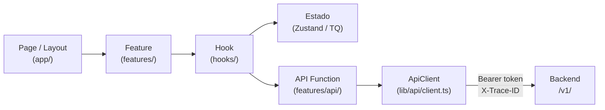

# ARCHITECTURE — Web (Next.js)

> **Documento para agentes de IA.**
> Lee `ARCHITECTURE.md` primero para entender el sistema completo. Este documento cubre exclusivamente la capa web: Next.js.
> Todas las decisiones están tomadas. Sigue este documento como fuente de verdad al scaffoldear o extender la aplicación web. No improvises estructura ni cambies naming sin justificación.

---

## Stack de esta capa

| Componente | Tecnología |
|---|---|
| Framework | Next.js 14+ (App Router) |
| Lenguaje | TypeScript |
| Estilos | Tailwind CSS |
| Estado global | Zustand |
| Estado de servidor | TanStack Query |
| Auth cliente | Firebase Authentication (client SDK) |
| Despliegue | Vercel |

---

## 1. Responsabilidad y scope

Next.js cubre: landing pública, paneles internos, dashboards, vistas autenticadas, reporting y formularios complejos de negocio.

**Lo que la capa web NO hace:**
- Contener lógica de negocio (eso es el backend NestJS).
- Validar tokens Firebase server-side para autorización de negocio (eso es NestJS).
- Gestionar archivos directamente (la subida va a R2 vía URLs firmadas que entrega NestJS).
- Comunicarse directamente con Neon, Redis o cualquier base de datos.

---

## 2. Flujo de datos



---

## 3. Estructura de carpetas

```
src/
├── app/                    ← Rutas y layouts únicamente. Sin lógica de negocio.
│   ├── (public)/           ← Landing, marketing, páginas sin auth
│   ├── (auth)/             ← Login, registro, recuperación de contraseña
│   └── (dashboard)/        ← Paneles autenticados, una carpeta por sección
│
├── features/               ← Una carpeta por dominio del producto
│   ├── auth/
│   │   ├── components/     ← Componentes visuales propios de auth
│   │   ├── hooks/          ← useAuth, useSession
│   │   ├── store/          ← Estado global de auth (Zustand)
│   │   ├── api/            ← Funciones que llaman al ApiClient
│   │   └── types.ts        ← Tipos propios de la feature
│   ├── users/
│   ├── organizations/
│   ├── files/
│   └── billing/
│
├── components/
│   ├── ui/                 ← Piezas visuales puras: Button, Input, Modal, Table
│   └── shared/             ← Componentes de producto reutilizables: PageHeader, EmptyState
│
├── entities/               ← Tipos de dominio compartidos entre features
│   ├── user/
│   ├── organization/
│   └── file/
│
├── theme/                  ← Sistema visual. Ver sección 8.
│
├── lib/
│   ├── api/
│   │   └── client.ts       ← ApiClient único. Único punto de salida HTTP.
│   ├── auth/               ← Inicialización Firebase + manejo de sesión
│   └── utils/              ← Helpers genéricos
│
└── types/                  ← Tipos globales y declaraciones TypeScript
```

---

## 4. Reglas de la capa web

- `app/` solo compone páginas usando features. No contiene lógica de negocio.
- `components/ui/` nunca conoce entidades del negocio ni llama APIs.
- `lib/api/client.ts` es el único archivo que puede hacer llamadas HTTP. No hay `fetch` ni `axios` en ningún otro lugar.
- Ningún componente de feature define colores, spacing o radios con valores literales.
- Estado global: Zustand. Estado de servidor (queries): TanStack Query. No se mezclan.
- Nunca usar clases de color directas de Tailwind (`text-blue-500`, `bg-slate-900`). Solo nombres semánticos mapeados desde el tema.

---

## 5. ApiClient — contrato

`lib/api/client.ts` es el único punto de salida HTTP de toda la aplicación web.

**Responsabilidades del ApiClient:**
- Adjuntar el Bearer token de Firebase en el header `Authorization`.
- Generar y adjuntar un UUID como `X-Trace-ID` en cada request.
- Manejar errores HTTP y transformarlos en errores tipados.

**Cómo obtener el token:**
```typescript
import { getAuth } from 'firebase/auth';

const token = await getAuth().currentUser?.getIdToken();
```

**Reglas:**
- Nunca importar ni usar `fetch` o `axios` fuera de `client.ts`.
- Nunca adjuntar el token manualmente en una feature. El ApiClient lo hace siempre.
- El `X-Trace-ID` viaja de vuelta en la respuesta y debe loggearse si hay error.

---

## 6. Auth — perspectiva web

### Responsabilidad del cliente web

La capa web solo gestiona la identidad del usuario en el cliente:
- Inicializar el Firebase client SDK.
- Manejar el estado de sesión (login, logout, estado de carga inicial).
- Obtener y refrescar el token para adjuntarlo en cada request.

**La capa web NO valida tokens. NO toma decisiones de autorización de negocio.** Eso es responsabilidad del backend NestJS (ver `ARCHITECTURE_BACKEND.md` sección 7).

### Flujo en el cliente

1. Usuario hace login → Firebase emite JWT.
2. El hook `useAuth` (en `features/auth/hooks/`) observa el estado de `onAuthStateChanged`.
3. El ApiClient llama `getIdToken()` antes de cada request para obtener el token vigente (Firebase refresca automáticamente si está expirado).
4. Si el backend responde 401, el ApiClient intenta refrescar el token una vez y reintenta. Si vuelve a fallar, redirige a login.

### Inicialización Firebase (web)

```typescript
// lib/auth/firebase.ts
import { initializeApp } from 'firebase/app';
import { getAuth } from 'firebase/auth';

const app = initializeApp({
  apiKey: process.env.NEXT_PUBLIC_FIREBASE_API_KEY,
  authDomain: process.env.NEXT_PUBLIC_FIREBASE_AUTH_DOMAIN,
  projectId: process.env.NEXT_PUBLIC_FIREBASE_PROJECT_ID,
});

export const auth = getAuth(app);
```

---

## 7. Variables de entorno — web (Vercel)

### Distinción importante

| Tipo | Prefijo | Visible en | Puede contener secretos |
|---|---|---|---|
| Públicas (bundleadas) | `NEXT_PUBLIC_` | Cliente + Servidor | **No** — va al bundle del cliente |
| Privadas | sin prefijo | Solo Servidor (SSR/API Routes) | Sí |

### Variables de la capa web

| Variable | Tipo | Descripción |
|---|---|---|
| `NEXT_PUBLIC_FIREBASE_API_KEY` | Pública | API Key de Firebase (no es un secreto real) |
| `NEXT_PUBLIC_FIREBASE_AUTH_DOMAIN` | Pública | Dominio de auth de Firebase |
| `NEXT_PUBLIC_FIREBASE_PROJECT_ID` | Pública | ID del proyecto Firebase |
| `NEXT_PUBLIC_API_URL` | Pública | URL base del backend NestJS |
| `NEXT_PUBLIC_APP_ENV` | Pública | `production` / `staging` / `development` |

**Regla:** Ningún secreto real (tokens de servicio, claves privadas) va en variables `NEXT_PUBLIC_`. Si necesitas hacer llamadas autenticadas server-side, usa API Routes de Next.js con variables privadas.

---

## 8. Theme architecture — web

### Jerarquía de tokens

Los tokens siguen tres niveles: Core → Semantic → Component (ver diagrama en `ARCHITECTURE.md` sección 7).

Para la capa web, los semantic tokens se convierten en **CSS custom properties** y Tailwind las consume.

### Estructura de carpetas del tema (web)

```
theme/
├── tokens/
│   ├── core.ts             ← Primitivos: paleta completa, escala de spacing, radios, tipografía
│   ├── semantic.light.ts   ← Roles semánticos para modo claro
│   └── semantic.dark.ts    ← Roles semánticos para modo oscuro
│
└── web/
    ├── variables.css       ← Core y semantic tokens como CSS custom properties
    └── tailwind.config.ts  ← Tailwind consume las variables CSS. No define colores propios.
```

### Semantic tokens mínimos requeridos

| Categoría | Tokens mínimos |
|---|---|
| Background | `primary`, `secondary`, `tertiary` |
| Surface | `default`, `raised`, `overlay` |
| Text | `primary`, `secondary`, `disabled`, `inverse` |
| Border | `default`, `strong`, `focus` |
| Brand | `primary`, `primaryHover`, `primaryActive` |
| Status | `success`, `warning`, `error`, `info` |

### Ejemplo de uso correcto en componente

```tsx
// ✅ Correcto — usa nombre semántico
<div className="bg-background-primary text-text-primary border-border-default">

// ❌ Incorrecto — valor literal de Tailwind
<div className="bg-white text-gray-900 border-gray-200">
```

### Reglas del tema web

- Tailwind no define el tema. Solo consume los tokens via CSS custom properties en `tailwind.config.ts`.
- Ningún componente de feature usa clases de color directas de Tailwind. Solo usa nombres semánticos mapeados.
- El tema soporta modo claro y oscuro via CSS custom properties con `@media (prefers-color-scheme: dark)` o clase `.dark`.

---

## 9. Instrucciones para agentes — crear nueva feature web

1. Crea `src/features/[nombre]/` con: `components/`, `hooks/`, `store/`, `api/`, `types.ts`.
2. Define los tipos en `types.ts`.
3. Crea las funciones en `api/` usando `apiClient`. Nunca `fetch` ni `axios` directo.
4. Crea el store en `store/` con Zustand si hay estado global. TanStack Query si es estado de servidor.
5. Crea los hooks en `hooks/` que orquestan store y llamadas API.
6. Crea los componentes en `components/` que consumen los hooks.
7. Agrega la página en `src/app/` que compone los componentes de la feature.

---

## 10. Instrucciones para agentes — proyecto nuevo (web)

1. Crea la estructura de carpetas exacta definida en la sección 3.
2. Instala dependencias base: Next.js 14+, TypeScript, Tailwind CSS, Zustand, TanStack Query, firebase.
3. Crea el `ApiClient` base en `lib/api/client.ts` con los interceptores de auth y trace.
4. Inicializa Firebase client SDK en `lib/auth/firebase.ts`.
5. Crea la estructura de tema base en `theme/` con los semantic tokens mínimos de la sección 8.
6. Configura `tailwind.config.ts` para consumir las CSS custom properties del tema.
7. Crea `.env.example` con todas las variables de la sección 7 con valores vacíos.
8. Verifica que ningún componente base tiene colores o valores hardcodeados.

---

## 11. Checklist de proyecto nuevo — web

### Estructura
- [ ] Estructura exacta de carpetas creada
- [ ] Dependencias base instaladas (Next.js, TypeScript, Tailwind, Zustand, TanStack Query, firebase)
- [ ] `.env.example` completo con todas las variables requeridas
- [ ] `.gitignore` configurado (node_modules, .env, .next, etc.)

### Auth
- [ ] Firebase project configurado
- [ ] Firebase client SDK inicializado en `lib/auth/firebase.ts`
- [ ] Hook `useAuth` implementado con `onAuthStateChanged`
- [ ] Flujo completo de login → token → request autenticado probado

### ApiClient
- [ ] `lib/api/client.ts` implementado con Bearer token y X-Trace-ID
- [ ] Manejo de 401 (refresh + retry) implementado
- [ ] Ninguna feature importa `fetch` o `axios` directamente

### Theme
- [ ] Core tokens definidos para el proyecto
- [ ] Semantic tokens para light y dark definidos
- [ ] CSS custom properties generadas en `theme/web/variables.css`
- [ ] `tailwind.config.ts` configurado para consumir las variables
- [ ] Verificado que ningún componente base tiene colores hardcodeados

### Validación final
- [ ] Build pasa sin errores (`next build`)
- [ ] TypeScript sin errores (`tsc --noEmit`)
- [ ] Flujo de auth funciona end-to-end
- [ ] Modo oscuro funciona correctamente

---

*Versión: 1.0 — Marzo 2026*
*Derivado de ARCHITECTURE.md v2.1. Lee ese documento primero para el contexto del sistema completo.*
